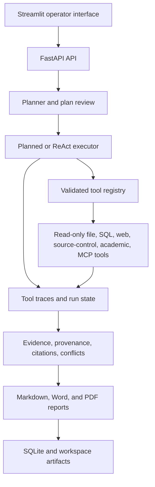

# Traceable Research Agent

[](#quick-start)
[](#quick-start)

**Traceable Research Agent** is a self-hosted research application for teams
that need to inspect how an answer was produced. It plans a multi-step task,
runs only registered read-only tools, stores every call and failure as a trace,
and produces an evidence-backed Markdown report.

[中文说明](README_zh.md) | [Quick start](#quick-start) | [API](#api) | [Architecture](#architecture)

## Why Traceable Research Agent

- **Inspectable execution**: persist the task plan, run state, progress, tool
  inputs and outputs, errors, latency, and cost estimates in SQLite.
- **Read-only by default**: local files, SQL, web, source-control, academic,
  and MCP tools are registered explicitly and checked before they execute.
- **Human control**: a plan can pause for review, and guarded operations pause
  for confirmation instead of running silently.
- **Evidence-first reports**: citations, provenance, source basis, conflicts,
  and citation-validation metrics are available alongside the report.
- **Governed research inputs**: retrieval profiles enforce source-tier quotas,
  bounded discovery and fetch budgets, and auditable targeted refetches.
- **Local extraction pipeline**: HTML fallback extraction, integrity-checked
  fetch caching, page-level PDF evidence, and reference verification work
  through the same traceable tool boundary.
- **Works without remote services**: deterministic planning and local tools
  support an offline-friendly audit flow; remote search and LLM synthesis are
  optional enhancements.
- **One-command deployment**: FastAPI and Streamlit start together with Docker
  Compose and retain runtime data under the mounted `workspace/` directory.

## Demo

The shortest demonstration uses only local data. It creates a three-step plan,
reads an allowlisted document, runs a read-only SQL query, and produces a
traceable report.

```powershell
$body = @{
  task = "Audit the local research note and document metadata"
  report_type = "summary"
  source_mode = "mock"
  skill_name = "local_audit"
  require_plan_approval = $true
} | ConvertTo-Json

$created = Invoke-RestMethod -Method Post -Uri http://localhost:8000/api/tasks `
  -ContentType application/json -Body $body

Invoke-RestMethod -Method Get `
  -Uri "http://localhost:8000/api/tasks/$($created.run_id)/review"

$approval = @{ approved = $true; comment = "approved after review" } | ConvertTo-Json
Invoke-RestMethod -Method Post `
  -Uri "http://localhost:8000/api/tasks/$($created.run_id)/approve-plan" `
  -ContentType application/json -Body $approval

Invoke-RestMethod -Method Get `
  -Uri "http://localhost:8000/api/tasks/$($created.run_id)/trace"
```

The resulting run moves from `waiting_human_plan` to `completed`. Its trace
contains `memory_recall`, `plan_approval`, the executed local tools, and
`citation_validator`. Retrieve the report at
`GET /api/reports/{run_id}`.

For a real web-research demonstration, configure `TAVILY_API_KEY` and run:

```powershell
.\.venv\Scripts\python.exe scripts\demo_real_research.py --preset 1 --report-type detailed_report
```

This script performs search, fetch, evidence compression, and report creation.
Generated output remains local under `docs/examples/` and is intentionally not
published by default.

## Quick Start

Prerequisite: Docker Desktop or Docker Engine with Compose v2.

```powershell
git clone https://github.com/piao666/traceable-research-agent.git
Set-Location traceable-research-agent
Copy-Item .env.example .env
docker compose up --build -d
```

Docker applies schema migrations and initializes the local demo database when
the API container starts. Wait until the API is healthy, then open:

- Streamlit: <http://localhost:8501>
- React web (D01–D04): <http://localhost:5173>
- FastAPI documentation: <http://localhost:8000/docs>
- Health check: <http://localhost:8000/health>

To inspect the service lifecycle:

```powershell
docker compose ps
docker compose logs --tail 100 api
docker compose logs --tail 100 streamlit
```

Runtime data, reports, evidence artifacts, and the SQLite database live under
`workspace/`, which Compose mounts into both services. Stop the application
without removing that data:

```powershell
docker compose down
```

For a local Windows virtual environment, the repository-root starter resolves
the project path from its own location and launches FastAPI plus Streamlit:

```powershell
.\start_traceable_demo.bat --check
.\start_traceable_demo.bat
```

MCP is not required by the core application. To also launch the optional MCP
Source Pack on port 9001, use `start_traceable_demo.bat --with-mcp`.
When a default port is unavailable, set `TRACEABLE_API_PORT`,
`TRACEABLE_STREAMLIT_PORT`, or `TRACEABLE_MCP_PORT` before running the script.

## Configuration

Copy `.env.example` to `.env`; it documents every available setting. `.env` is
local-only and must never be committed.

| Setting | Default | Purpose |
|---|---|---|
| `AUTH_ENABLED` | `false` | Enable local API-key authentication. |
| `DEMO_API_KEY` | empty | API key required when authentication is enabled. |
| `EXECUTION_MODE` | `planned` | Choose stable planned execution or `react`. |
| `OFFLINE_MODE` | `false` | Disable remote tool use for offline operation. |
| `REPORT_GENERATION_MODE` | `deterministic` | Use offline-safe reporting or configured LLM reporting. |
| `TAVILY_API_KEY` | empty | Enable real web search. |
| `QWEN_API_KEY` / `DEEPSEEK_API_KEY` | empty | Enable an optional configured LLM provider. |
| `FILE_READER_ALLOWED_ROOTS` | `workspace/docs` | Allowlisted roots for local file reads. |
| `CITATION_VALIDATION_LLM_ENABLED` | `false` | Enable optional second-pass LLM citation validation. |

Remote keys are optional. The local demo and deterministic report path do not
need them. When `AUTH_ENABLED=true`, send the configured key in the
`X-API-Key` header (or as a Bearer credential).

## API

| Endpoint | Purpose |
|---|---|
| `GET /health` | Service and database readiness. |
| `POST /api/tasks` | Create a planned research task. |
| `GET /api/tasks/{run_id}` | Read status, progress, cost, and citation metrics. |
| `POST /api/tasks/{run_id}/run` | Execute a created task. |
| `GET /api/tasks/{run_id}/review` | Read a plan waiting for approval. |
| `POST /api/tasks/{run_id}/approve-plan` | Approve, edit, or reject that plan. |
| `POST /api/tasks/{run_id}/confirm` | Resume or reject a guarded operation. |
| `GET /api/tasks/{run_id}/trace` | Read persisted tool traces. |
| `GET /api/tasks/{run_id}/evidence/v2` | Read provenance and citations. |
| `GET /api/reports/{run_id}` | Fetch the Markdown report. |
| `GET /api/tools` | List registered tool metadata. |
| `GET /api/skills` | List installed task skills. |
| `GET /api/improvement/stats` | Read final-run quality statistics for a real date window. |
| `GET /api/improvement/runs/{run_id}` | Read the five-dimensional final quality evaluation for one run. |
| `GET /api/improvement/state` | Inspect local routing-weight and Few-shot cold-start state. |

Plans and task status responses expose multi-skill composition and adaptive
Planned-to-ReAct metadata. During an adaptive quality gate or deep-research
round, realtime clients keep the run open and receive `report_ready` only when
the final report is stable.

The OpenAPI interface at `/docs` is the complete, versioned request and
response reference.

## Architecture



```text
app/api/       FastAPI endpoints and response contracts
app/agent/     planning, execution, report generation, and guardrails
app/tools/     registered read-only tool implementations
app/trace/     run and tool-call persistence
app/evidence/  provenance, citation, and conflict reasoning
app/memory/    single-instance sessions and optional memory
app/skills/    reusable task definitions and validation
app/mcp/       optional read-only MCP integration
frontend/      Legacy Streamlit interface
web/           React, TypeScript, and Vite interface
migrations/    Alembic schema history
scripts/       migration, demo, smoke, and evaluation commands
workspace/     local databases, reports, artifacts, and skills
```

## Safety Model

- The executor can invoke only tools registered in the unified registry.
- `file_reader` resolves paths, blocks traversal and escaping symlinks, limits
  content length, and reads only configured roots.
- `sql_query` accepts one read-only `SELECT` or `WITH` statement and enforces a
  row limit.
- External and MCP integrations are read-only, time-bounded, and redact
  secrets from persisted trace data.
- Failed and rejected tool calls remain visible in run status and traces.
- Plan approval and high-risk tool confirmation are explicit state transitions,
  never hidden background actions.

## Quality Checks

The current registry exposes **12 read-only tools**. The latest local closure
passed **338 tests and 17 subtests**, plus **80/80 deterministic evaluation
cases** with no hard failures or network skips. The checks cover source
governance, cache behavior, PDF extraction, reference verification, academic
retrievers, API contracts, and the existing execution paths.

Run the same core checks locally:

```powershell
.\.venv\Scripts\python.exe -m compileall -q app scripts frontend migrations tests
.\.venv\Scripts\python.exe -m pytest -q
.\.venv\Scripts\python.exe scripts\smoke_final_project.py
.\.venv\Scripts\python.exe -m app.eval.regression
.\.venv\Scripts\python.exe scripts\skill_smoke.py --all
docker compose config --quiet
```

## Roadmap

- [x] Traceable planned and optional ReAct execution
- [x] Evidence provenance, citation validation, and human plan approval
- [x] Source-tier governance, cached extraction, PDF evidence, and academic verification
- [x] Docker deployment with persistent local runtime data
- [ ] Add a repository license before public redistribution
- [ ] Expand operational observability for long-running self-hosted instances

## Contributing

Issues and focused pull requests are welcome. Keep changes within the project
boundary, preserve read-only tool guarantees, add focused tests for behavior
changes, and do not commit `.env`, local databases, generated reports, or
other local runtime data. See [AGENTS.md](AGENTS.md) for engineering rules.

## License

This repository currently has no root-level `LICENSE` file. Until a license is
added, no permission to use, copy, modify, or redistribute the code is granted
by this README. Add an explicit license before treating the project as a public
open-source distribution.

## References

This is an independent implementation. External agent-system materials are
used only as read-only design references; no external project source is copied
into this repository.
