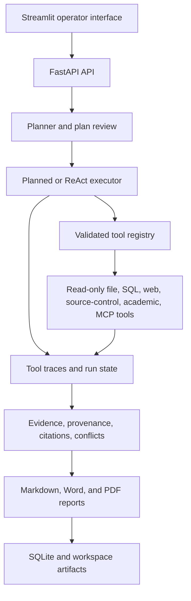

# Traceable Research Agent

[](#quick-start)
[](#quick-start)

**Traceable Research Agent** is a self-hosted research application for teams
that need to inspect how an answer was produced. It plans a multi-step task,
runs only registered read-only tools, stores every call and failure as a trace,
and produces an evidence-backed Markdown report.

[中文说明](README_zh.md) | [Quick start](#quick-start) | [API](#api) | [Architecture](#architecture)

## Why Traceable Research Agent

### Deep Research Engine V2 (R12)

Deep Profile now has one official execution path: a persisted Research Scope
containing a Research Tree of root and branch Runs. `AgentRun` records explicit
`parent_run_id`, `root_run_id`, `run_role`, `research_scope_id` and
`engine_version` lineage; migration `0012_research_scope_and_lineage` backfills
existing Runs without relying on `plan_json` as the authority.

Each branch reuses the existing governed ReAct executor, read-only Tool
Registry, recovery policy, Trace, Evidence Pipeline and the root Run's shared
budget. Branch Evidence stays owned by the branch Run. A read-only Scope layer
aggregates it logically for outcome checks and final synthesis, preserving the
chain `Citation → Passage → Snapshot → Trace → origin_run_id`. The root writes
one final report from the complete Scope; node completion no longer writes an
intermediate report that omits sibling evidence. Standard and Offline profiles
continue to use their existing executors.

The legacy `app.agent.deepening.run_deepening` symbol remains for one
compatibility release as a deprecation-warning adapter to Engine V2; the
Dispatcher no longer calls the legacy round engine. Research intelligence,
coverage/gap policy and hierarchical long-report composition remain R13/R14.

### Adaptive retrieval and source reliability (R11)

R11 keeps the public `web_fetcher` tool contract while replacing its internals
with an adaptive retrieval router. Static HTTP remains the first and cheapest
backend. A successful HTTP status is accepted only after extraction-quality
checks; JavaScript shells, Cloudflare or bot challenges, CAPTCHA, cookie/login
walls, soft 404/429 pages, paywalls, raw PDF data and low-quality boilerplate
are classified rather than treated as research evidence. Eligible failures can
fall back inside the same tool call to an isolated Playwright context and then
to configured Firecrawl or Exa extraction. PDF URLs and detected PDF responses
are delegated to the existing page-aware PDF reader.

Every backend returns one `FetchResult` shape with requested/final/canonical
URLs, stable status, provider, extraction method and confidence, redirect
chain, content basis/hash and source identity. Canonical URL and content-hash
deduplication prevent equivalent pages from being fetched or materialized as
independent evidence more than once. The same metadata is retained in Trace,
`SourceDocument` and `SourceSnapshot`; Agent recovery sees the final URL-level
outcome instead of repeatedly retrying static HTTP.

Advanced limits and provider order are documented only in `.env.example.full`.
Docker installs the pinned Playwright Chromium runtime. Real static, Browser,
PDF and configured remote-extractor checks are deliberately confirmation-gated:

```powershell
.\.venv\Scripts\python.exe scripts\validate_real_runtime.py --confirm-real-calls --r11-fetch-smoke
```

The offline suite uses injected HTTP/browser/provider fixtures and never makes
these real calls. R11 itself remains the retrieval layer; R12 consumes its
uniform Fetch results without coupling the Engine to an individual backend.

### Real Runtime profiles and preflight (R10)

R10 makes a real research deployment explicit. `RESEARCH_PROFILE` supplies
coherent defaults, and any explicitly set environment variable still overrides
its Profile value:

| Profile | Intended use | Default behavior |
|---|---|---|
| `deep` | real multi-source research | dynamic ReAct, LLM planning/reporting, deepening, broad safety ceilings, no mock fallback |
| `standard` | lower-cost real research | planned/adaptive execution, real search/fetch and LLM reporting, no deepening by default |
| `offline` | development, CI and demonstrations | deterministic planning/reporting and explicitly isolated fixture sources |

The minimum real configuration is:

```env
RESEARCH_PROFILE=deep
LLM_PROVIDER=openai_compatible
LLM_BASE_URL=https://example.com/v1
LLM_MODEL=your-model
LLM_API_KEY=your-key
SEARCH_PROVIDER=tavily
TAVILY_API_KEY=your-key
```

The generic adapter uses OpenAI-compatible Chat Completions. The legacy `qwen`
and `deepseek` names remain aliases with their existing endpoint/model defaults.
Provider failures use stable categories such as `auth_error`,
`permission_error`, `rate_limited`, `timeout`, `model_not_found`,
`context_overflow`, `malformed_response` and `structured_output_invalid`.
Non-retryable configuration errors stop retrying; transient failures use bounded
backoff; ReAct records the category in Trace and can fall back without expanding
tool permissions. Context overflow activates a smaller persisted observation
window for one bounded retry.

`GET /api/runtime/capabilities` is a non-network configuration projection.
`POST /api/runtime/preflight` is an explicit, quota-consuming check of the real
LLM completion/JSON response, Tavily result provenance and static page fetch. The
new-research page shows only the concise readiness result and lets the user start
this explicit verification; credentials, endpoints, prompts and response bodies
are never returned. PDF, academic and remote MCP capabilities remain separate;
optional capability absence does not make an otherwise usable real runtime fail.

The research roles are logically separated even when one model serves all of
them: Planner builds the task contract and plan, Actor selects and runs permitted
tools, Critic evaluates coverage/evidence gaps, and Synthesizer writes only from
the active traceable evidence revision. `.env.example.full` is the advanced
configuration reference, while `.env.example.offline` keeps fixture mode out of
the normal real-runtime setup.

For an explicit command-line acceptance check, run preflight first and add
`--run-task` to persist one real search → fetch → LLM-report Run. The confirmation
flag is mandatory so tests and accidental invocations cannot consume quota:

```powershell
.\.venv\Scripts\python.exe scripts\validate_real_runtime.py --confirm-real-calls
.\.venv\Scripts\python.exe scripts\validate_real_runtime.py --confirm-real-calls --run-task
```

The automated suite verifies Profiles, aliases, adapter usage normalization,
error classification/retry behavior across Planner, Actor, Critic and
Synthesizer, mock rejection, secret redaction, preflight contracts and the
no-call confirmation guard. Live-provider acceptance still has to be run in the
operator's configured deployment.

### Goal integrity and bounded recovery (R9)

Explicit inability, unavailable tools and exhausted ReAct steps cannot become
successful research merely because some source text exists. Price-series requests
get a creation-date-anchored task contract: unclear dates, sampling interval or
adjustment basis block approval with a task-clarification message, not key advice.
The contract is application-derived and inherited by deepening children. Completion
requires actual reader-provided tabular data matching the requested metric, basis
and basic date coverage; close prices are not a requested return series. These
conservative checks are not a financial-data connector, name-to-symbol resolver,
exchange-calendar audit, return calculator or general fact-checking oracle.

Fetched text can be paged through the permitted `web_fetcher` using a current-Run
`source_id`, `offset` and `max_chars`, without another HTTP request. Snapshot reads
retain original Trace identity and create no duplicate evidence. Source IDs are
not local filenames. Repeated unchanged fetches and unsupported HTML file reads
are blocked before tool/HITL execution. Mixed URL requests fetch only novel,
deduplicated pages; unread search candidates remain available
within the source-policy tiers. Obvious loading/template shells are not full text.

Pending or previously failed source IDs now resolve to the URL recorded by the
same Run instead of being treated as readable snapshots. Equivalent fetch inputs
share a recovery identity, and up to two rejected/non-executed decisions receive
bounded replacement slots. Multi-URL fetches stop before the registry deadline,
return completed pages, and mark deferred pages explicitly. Technical tasks infer
the `technical_facts` profile unless the caller selects another profile; supported
vendor documentation and verified repositories are classified as primary sources.
Search-only and partial passages use medium rather than high evidence confidence.

Budget exceptions keep their structured stop reason through synthesis and children.
New ledgers reserve up to 8,000 tokens (10% of the total) and two LLM calls (20%)
for the final root report; a full retry has its own ledger. Reaching that reserve
in root research is now a non-terminal handoff to the quality gate and report path;
actual total-cap, deadline, permission and cost breaches remain terminal. Optional
deepening is skipped when headroom is low. Real/mock separation is unchanged.
Planned-to-ReAct upgrades use their dynamic step allowance with monotonic Trace
numbers. Legacy child `/plan` responses normalize missing steps read-only; child
links persist before execution. Ordinary task lists hide deepening children while
keeping direct audit access. Previous integrity versions require review, not rewrite.
Deep-research ReAct allowances can grow from the configured base according to depth,
breadth and comparison-contract complexity. Core discovery/fetch tools receive a
broader task-aware per-tool allowance while the shared tool, LLM, token and time
limits remain safety ceilings rather than the research strategy itself.
Full tool bodies remain in Trace; persisted ReAct observations retain only bounded
decision summaries and snapshot excerpts so `/plan` polling does not duplicate them.

Requested overview/new-research copy and Capabilities/System navigation entries
are removed; underlying routes/APIs remain. Citation sentence parsing preserves
decimal values and URLs. See [latest verification and limits](RELEASE_VALIDATION.md).

### Research integrity (R0–R3)

Tool success is not research completion. Missing required configuration blocks
execution without discarding a draft. `GET /api/runtime/capabilities` discloses
configuration presence (never secrets); `GET /api/tasks/{run_id}/preflight`
checks the actual plan. Neither endpoint verifies external connectivity; the
explicit R10 `POST /api/runtime/preflight` does.

- Local file/SQL plans need no search or model keys unless LLM mode is requested.
- Empty upstream results skip dependent fetches. Zero usable evidence or a failed
  required fetch/step fails the run before report generation. Partial results
  retain explicit warnings; an explicitly selected LLM report cannot silently
  become a rule-based report when synthesis fails.
- Errors, approvals, memory-recall messages and model finish summaries remain in
  Trace but are not sources. Search snippets and fetched page text are distinct.
  Citation checks evaluate answer text, not the citation index; no citations means
  not evaluated, never 100%. Citation IDs are never repaired by numeric proximity.
- Failed/cancelled runs can be fully retried as a new Run with current configuration
  and fresh approvals. Cancellation cannot be overwritten by late completion.
- Old reports and traces are retained and labelled for review. Legacy quality
  records are excluded from trusted trends/routing; active evidence revisions are
  append-only. No automatic database purge or historical rewrite is performed.

The **Deep Web template**, automatically selected execution mode, and deployment-level
`DEEP_RESEARCH_ENABLED` switch are separate. New-research UI no longer submits a
manual Planned/ReAct override; the backend records the deterministic routing reason.
Its default retrieval strategy is also automatic, allowing technical-comparison
tasks to infer `technical_facts`. The switch only adds rounds to ReAct. Follow-up
learning notes are not supported conclusions: inspect their
linked sub-runs. D01–D11 now have API-connected pages. R6 shared-state,
responsive and keyboard/focus changes are implemented locally; browser visual
and current Figma reconciliation checks remain unverified. R7 regression and
deployment preparation is recorded in [release validation](RELEASE_VALIDATION.md);
Docker/Streamlit runtime, full pytest and visual/provider acceptance remain open.

### Execution constraints and recovery (R8.0–R8.2)

Skill permissions include their required tools by default. Explicit restrictions,
including an empty list, remain authoritative; a required capability filtered out
of a deep Web plan blocks approval rather than silently weakening the plan.
Real runs reject mock/offline/fallback arguments and demonstrative outputs in
planned, parallel, ReAct and targeted-refetch execution. Demonstration runs
remain explicitly separate. Deepening children inherit their parent's permissions.

ReAct treats GitHub and remote MCP as optional sources for general deep Web
research. Authentication failures disable the affected provider for that Run;
rate limits/transient provider errors cool it down, while a failed page or bad
input blocks that input rather than the entire reader. Available alternatives
remain selectable after another tool reaches its call limit. Recovery is recorded
in Trace and persisted for resume; a full retry starts with fresh recovery state.
ReAct owns GitHub/Tavily retries to prevent nested transport retries exceeding
the existing same-tool cap. Rejected selections still consume the bounded step
budget. Completion still requires usable evidence; recovery never relaxes it.

R8.0–R8.2 itself needs no new settings or migration. R8.3–R8.5 below adds a
budget ledger. Synthetic tests do not demonstrate live-model autonomy or
external-provider availability; see the [validation ledger](RELEASE_VALIDATION.md).

### Source context, shared budgets and exact provenance (R8.3–R8.5)

ReAct rebuilds a bounded source queue from persisted traces, not the last few
summary strings. It retains URLs, titles, excerpts, source/Trace identities,
fetch status, content basis and remaining fetch gaps. Up to 64 sources are kept;
the prompt exposes a compact domain-diverse mix that always includes fetched
evidence alongside priority pending sources. The full queue is not duplicated in
persisted `plan_json`; it is rebuilt from Trace and only gap summaries are retained.
Credential-bearing URLs and demonstration results are excluded. Source text is
untrusted data, never permission to execute instructions. Deepening prompts also
retain source URLs and originating Run/Trace identities.

Migration `0011_run_budgets` adds an atomic ledger shared by a root Run and its
deepening children. Defaults: 40 tool invocations, 40 LLM calls, 100,000 accounted
tokens and 900 wall-clock seconds. Resume preserves counters; full retry gets a
new ledger. Limits are checked before new operations, including parallel tool
admission and report LLM calls. Budget exhaustion fails explicitly while keeping
existing evidence/Trace; it cannot expose an intermediate report as final.
`GET /api/tasks/{run_id}/plan` exposes the current shared `execution_budget`.

The optional estimated-cost cap is in CNY and disabled by default. A nonzero cap
requires deployment-provided conservative tool/token price estimates; unknown
prices block external calls. Missing token usage retains a conservative language-
aware prompt/output reservation (CJK characters are not counted as UTF-8 bytes),
then reconciles to provider usage when available. This is not an exact tokenizer
or billing cap.
Time limits stop new work; in-flight calls retain transport timeouts. Tool counts
are invocations, not every URL/HTTP request within a reader. Draft planning,
independent tool API calls and separate post-run memory extraction are outside
the execution ledger. See `.env.example.full` for advanced `RESEARCH_*` settings.

New runs use `trace-source-v2`: plan goals are not treated as observed facts.
Extractive claims cite their actual source passages; report rendering and the
evidence API use the same authoritative Trace order. Identical repeated outputs
retain distinct Trace snapshots. Child evidence cannot be relabelled as parent
evidence; child learnings stay exploratory with linked sub-runs. Old reports and
evidence revisions remain intact; susceptible legacy ReAct mappings are flagged
for review and excluded from trusted quality trends.

### Execution explanations and integration checks (R8.6)

The workbench uses the typed, read-only `execution_insights` field only for the
bounded candidate-source queue with exact Trace links. Internal shared-budget,
tool-recovery and permission-list details remain available through the API and Trace
but are intentionally not rendered in the user-facing workbench. Missing API data
is not shown as zero sources.

Plan review omits internal allowed-tool lists, planner notes and generic execution-
boundary callouts. Source queues are candidates, not verified evidence;
evidence/report pages identify source excerpts separately from verified conclusions
and expose snapshot/Trace identities. Persisted English integrity warnings from
older Runs are translated to Chinese in the UI. No browser-based budget/key editing
is added.

Offline integration covers GitHub 401 → non-GitHub source URL → fetch → actual
saved Markdown with resolvable provenance → typed page contract. DOM tests cover
page refresh, hidden internal execution details, Chinese integrity warnings,
cancellation, and report → evidence → Trace navigation. External providers/model decisions remain fixtures. Full pytest,
container/runtime, browser/390px and live-provider acceptance are still separate,
unpassed gates; see [release validation](RELEASE_VALIDATION.md).

### Shared UI states and accessibility (R6)

Unknown/loading metrics show `—`, not zero. Task and health requests fail
independently and offer retry. Plan review supports recovery, rejects approval
without explicit ready preflight, synchronizes conflicting Run state, distinguishes
pending approval/rejection and ignores late responses after leaving a Run.
Denied browser storage no longer crashes draft creation or promises a saved draft.

Shared native modals label their purpose, manage initial/return focus and guard
busy operations. Navigation has a skip link, route titles and focus restoration;
status tabs support arrows/Home/End. Evidence/Trace links focus the exact target
without stealing focus on refresh. Tables and scrollable payloads are keyboard
reachable; external links announce a new window. Long text, narrow-screen task
cards, wrapping actions, reduced motion and text-token contrast are addressed.

Run offline frontend checks under `web/`: `npm run typecheck`, `npm run lint`,
`npm test`, `npm run build`. `node qa/smoke.mjs` checks the isolated fixture server;
`npm run dev -- --config qa/vite.config.ts` exposes `/qa/viewport.html` for manual
desktop/390px checks. This QA server disables the API proxy, forces a same-origin
fixture API and rejects all writes; it is not shipped in the production build.
See [QA instructions](web/qa/README.md) and [design mapping limits](web/README.md).
Mock DOM tests do not verify rendered layout, native focus trapping, screen-reader
behavior or complete accessibility conformance. These checks and real-provider
acceptance remain separate gates; final user acceptance stays after R6–R7.

### Local modules (R5 / D08–D11)

- `/sessions`: create/rename sessions, inspect persisted turns and paginated
  linked Runs. Follow-up research carries `session_id`, uses a separate browser
  draft and still requires plan approval. Unknown sessions are rejected before
  Run creation. Session grouping does not inject the entire conversation into
  the planner: include needed background in the next research question.
- `/memory`: pending/active/expired/superseded filters, provenance links and
  explicit confirmation for activate/reject/delete. Rejection permanently deletes
  a pending item; clearing all statuses requires typing the confirmation phrase.
  Source sessions/Runs/reports remain intact. Effective expiry is interpreted
  without rewriting historical rows; expired items are excluded from recall.
- Migration `0010_memory_audit` adds a content-free audit table. Confirm/reject/
  delete/clear and their audit event are transactional; failed audit writes roll
  back the action. `GET /api/memory/audit` returns recent events, not research
  evidence. There is no fabricated audit backfill for past deletions.
- `/capabilities`: registered tools, risk/confirmation/schema details and Skill
  definitions/dependencies. Configuration presence is distinct from runtime
  success; remote MCP is optional. No tool-execute or browser key-edit controls.
- `/system`: `GET /api/runtime/diagnostics` checks actual DB reads/module tables
  and workspace directory permissions without external requests or write probes.
  Quality windows, daily trends and per-Run details use existing integrity gates.
  Empty quality is not evaluable; heuristic scores are not factual accuracy.

R5 offline checks: `python -m unittest tests.test_r5_modules tests.test_memory`
and `python scripts/smoke_research_integrity.py`. The smoke uses a disposable
SQLite DB, verifies session/memory/audit persistence across API restart and
never contacts providers. Startup applies the new migration to the deployment
DB only when you deploy; back up persisted data before deploying migrations.
Code and mocked tests do not replace browser, container or real-provider acceptance.

### Research workspace (R4 / D05–D07)

- `/runs/{id}` shows persisted status, plan, Trace payloads/failures, timing and
  recorded cost estimates. Explicit confirmation controls start, cancellation,
  human approval/rejection and full retry; retry creates a new Run without
  automatically starting it. Plan approval opens the corresponding workspace.
- `/runs/{id}/evidence` shows source snippets/content basis and the exact
  citation → claim → passage → source/Trace association. Missing/ambiguous IDs
  remain unresolved. Export downloads grouped sources/passages as JSON.
- `/runs/{id}/report` reads/downloads Markdown, links exact citation IDs to the
  evidence page and distinguishes not-generated, missing and blocked reports.
  The bounded safe reader supports headings, lists, tables, code and HTTP(S)
  links; it does not execute HTML or load remote images. Download the original
  for unsupported Markdown formatting. A resolved link is not fact verification.
- Live runs use resumable SSE plus 5-second HTTP reconciliation; waiting-human
  runs poll without repeated SSE reconnects, terminal runs close the stream.
  Nginx disables event buffering. List filtering/search/pagination is server-side
  (`status=waiting` covers both approval states, `q` searches task text/Run ID).
  SQLite timestamps without offsets are displayed as UTC converted to local time.
- `POST /api/tasks/{id}/confirm?start_async=true` schedules confirmed execution;
  the default synchronous contract remains compatible. Report JSON adds
  `availability`: `available`, `not_generated`, `missing`, or `blocked`.

Offline R4 checks: `python -m unittest tests.test_r4_workflow` and, under `web/`,
`npm run typecheck`, `npm run lint`, `npm test`, `npm run build`. These are not
real-provider or browser visual acceptance. Follow the remaining release gates
before final user-side deployment/API-key acceptance; never infer completion from Markdown
or a `completed` status alone.

After editing `.env` in the actual deployment directory, recreate the API service
with `docker compose up -d --force-recreate api`, then recheck the plan. No image
rebuild is needed for key-only changes. Do not send keys through the browser UI.

Offline regression commands (from the repository root):

```bash
python -m unittest tests.test_research_integrity -v
python scripts/smoke_research_integrity.py
python scripts/run_offline_tests.py --runner pytest
```

The smoke script copies code/bundled fixtures into a disposable repository and
uses a temporary database and localhost API. It checks missing-key blocking,
local file/SQL report generation and restart persistence of reports, Trace,
sessions, memory and audit. External socket requests are blocked. Real provider
connectivity, live research quality, and Docker startup require separate acceptance
after deployment keys are configured.

- **Inspectable execution**: persist the task plan, run state, progress, tool
  inputs and outputs, errors, latency, and cost estimates in SQLite.
- **Read-only by default**: local files, SQL, web, source-control, academic,
  and MCP tools are registered explicitly and checked before they execute.
- **Human control**: a plan can pause for review, and guarded operations pause
  for confirmation instead of running silently.
- **Evidence-first reports**: citations, provenance, source basis, conflicts,
  and citation-validation metrics are available alongside the report.
- **Governed research inputs**: retrieval profiles enforce source-tier quotas,
  bounded discovery and fetch budgets, and auditable targeted refetches.
- **Local extraction pipeline**: HTML fallback extraction, integrity-checked
  fetch caching, page-level PDF evidence, and reference verification work
  through the same traceable tool boundary.
- **Works without remote services**: deterministic planning and local tools
  support an offline-friendly audit flow; remote search and LLM synthesis are
  optional enhancements.
- **One-command deployment**: FastAPI and Streamlit start together with Docker
  Compose and retain runtime data under the mounted `workspace/` directory.

## Demo

The shortest demonstration uses only local data. It creates a three-step plan,
reads an allowlisted document, runs a read-only SQL query, and produces a
traceable report.

```powershell
$body = @{
  task = "Audit the local research note and document metadata"
  report_type = "summary"
  source_mode = "mock"
  skill_name = "local_audit"
  require_plan_approval = $true
} | ConvertTo-Json

$created = Invoke-RestMethod -Method Post -Uri http://localhost:8000/api/tasks `
  -ContentType application/json -Body $body

Invoke-RestMethod -Method Get `
  -Uri "http://localhost:8000/api/tasks/$($created.run_id)/review"

$approval = @{ approved = $true; comment = "approved after review" } | ConvertTo-Json
Invoke-RestMethod -Method Post `
  -Uri "http://localhost:8000/api/tasks/$($created.run_id)/approve-plan" `
  -ContentType application/json -Body $approval

Invoke-RestMethod -Method Get `
  -Uri "http://localhost:8000/api/tasks/$($created.run_id)/trace"
```

The resulting run moves from `waiting_human_plan` to `completed`. Its trace
contains `memory_recall`, `plan_approval`, the executed local tools, and
`citation_validator`. Retrieve the report at
`GET /api/reports/{run_id}`.

For a real web-research demonstration, configure `TAVILY_API_KEY` and run:

```powershell
.\.venv\Scripts\python.exe scripts\demo_real_research.py --preset 1 --report-type detailed_report
```

This script performs search, fetch, evidence compression, and report creation.
Generated output remains local under `docs/examples/` and is intentionally not
published by default.

## Quick Start

Prerequisite: Docker Desktop or Docker Engine with Compose v2.

```powershell
git clone https://github.com/piao666/traceable-research-agent.git
Set-Location traceable-research-agent
Copy-Item .env.example .env
# Edit .env and provide LLM_BASE_URL, LLM_MODEL, LLM_API_KEY and TAVILY_API_KEY.
docker compose up --build -d
```

For the React frontend only, use `docker compose up --build -d api web`.
The `api` image installs only `requirements/api.txt`; it does not download
Streamlit, PyArrow, Pandas, NumPy, PyDeck or pytest. The optional `streamlit`
image adds `requirements/streamlit.txt`. The legacy `light` Docker target is
still available with both runtimes. `pip install -r requirements.txt` remains
the full local development setup, including `requirements/dev.txt`.

### Recovering from interrupted dependency downloads

Docker bootstraps pip **26.2.1** before installing application dependencies,
with 5 connection attempts, 10 incomplete-download recovery attempts and a
120-second socket timeout. BuildKit caches pip downloads outside the final
image; downloaded artifact hashes and TLS verification remain enabled.
These settings follow the [pip download options](https://pip.pypa.io/en/stable/cli/pip/)
and [Docker cache-mount guidance](https://docs.docker.com/build/cache/optimize/#use-cache-mounts).
Direct dependencies are pinned; this split is not a complete transitive lockfile.

After updating to the repair commit, rebuild only the failed API image from
the repository/worktree root. Run each step only if the preceding one succeeds:

```powershell
docker compose --progress plain build api
if ($LASTEXITCODE -ne 0) { throw "API build failed; stop and inspect the download error." }
docker compose up -d --no-build api web
if ($LASTEXITCODE -ne 0) { throw "Startup failed; inspect docker compose logs api." }
docker compose ps
```

This recovery command assumes the web image already built successfully in
the same Compose project. For a fresh checkout, use
`docker compose up --build -d api web`. Do not use `--no-cache`, clear all
Docker caches, disable hash verification or replace an expected hash with the
hash of a failed download. If it still fails, check Docker Desktop's proxy and
package-download connectivity; longer timeouts cannot repair a broken proxy.
Upgrading Windows-host pip does not upgrade pip inside the Docker image.

Docker applies schema migrations and seeds the local demo database only if it is
absent when the API container starts. Existing demo files are preserved, including
unknown/corrupt files that require manual inspection; they are never reset.
Set `DOCKER_INIT_DEMO_DATA=false` to disable seeding. Back up the stopped
deployment workspace before upgrading; see [release validation](RELEASE_VALIDATION.md).
Wait until the API is healthy, then open:

- Streamlit: <http://localhost:8501>
- React web (D01–D11): <http://localhost:5173>
- FastAPI documentation: <http://localhost:8000/docs>
- Health check: <http://localhost:8000/health>

To inspect the service lifecycle:

```powershell
docker compose ps
docker compose logs --tail 100 api
docker compose logs --tail 100 streamlit
```

Runtime data, reports, evidence artifacts, and the SQLite database live under
`workspace/`, which Compose mounts into both services. Stop the application
without removing that data:

```powershell
docker compose down
```

For a local Windows virtual environment, the repository-root starter resolves
the project path from its own location and launches FastAPI plus Streamlit:

```powershell
.\start_traceable_demo.bat --check
.\start_traceable_demo.bat
```

MCP is not required by the core application. To also launch the optional MCP
Source Pack on port 9001, use `start_traceable_demo.bat --with-mcp`.
When a default port is unavailable, set `TRACEABLE_API_PORT`,
`TRACEABLE_STREAMLIT_PORT`, or `TRACEABLE_MCP_PORT` before running the script.

## Configuration

Copy `.env.example` to `.env` for the minimum real setup. Advanced overrides are
documented in `.env.example.full`; the isolated fixture setup is
`.env.example.offline`. `.env` is local-only and must never be committed.

| Setting | Default | Purpose |
|---|---|---|
| `AUTH_ENABLED` | `false` | Enable local API-key authentication. |
| `DEMO_API_KEY` | empty | API key required when authentication is enabled. |
| `RESEARCH_PROFILE` | `standard` in code; `deep` in `.env.example` | Select coherent real-deep, real-standard or offline defaults. |
| `DEEP_RESEARCH_ENGINE_VERSION` | `v2` | Pin the only supported Deep Profile engine; legacy V1 is not a runtime option. |
| `EXECUTION_MODE` | Profile-dependent | Advanced override for automatic routing defaults. |
| `OFFLINE_MODE` | Profile-dependent | Advanced override; use the `offline` Profile for normal offline work. |
| `REPORT_GENERATION_MODE` | Profile-dependent | Advanced override for deterministic or configured-LLM reporting. |
| `TAVILY_API_KEY` | empty | Enable real web search. |
| `QWEN_API_KEY` / `DEEPSEEK_API_KEY` | empty | Enable an optional configured LLM provider. |
| `FILE_READER_ALLOWED_ROOTS` | `workspace/docs` | Allowlisted roots for local file reads. |
| `CITATION_VALIDATION_LLM_ENABLED` | `false` | Enable optional second-pass LLM citation validation. |

Remote keys are optional. The local demo and deterministic report path do not
need them. When `AUTH_ENABLED=true`, send the configured key in the
`X-API-Key` header (or as a Bearer credential).

## API

| Endpoint | Purpose |
|---|---|
| `GET /health` | Service and database readiness. |
| `POST /api/tasks` | Create a planned research task. |
| `GET /api/tasks` | List user tasks; `include_internal=true` also returns deepening child Runs. |
| `GET /api/tasks/{run_id}` | Read status, progress, cost, and citation metrics. |
| `POST /api/tasks/{run_id}/run` | Execute a created task. |
| `GET /api/tasks/{run_id}/review` | Read a plan waiting for approval. |
| `POST /api/tasks/{run_id}/approve-plan` | Approve, edit, or reject that plan. |
| `POST /api/tasks/{run_id}/confirm` | Resume or reject a guarded operation. |
| `GET /api/tasks/{run_id}/trace` | Read persisted tool traces. |
| `GET /api/tasks/{run_id}/evidence/v2` | Read provenance and citations. |
| `GET /api/tasks/{run_id}/research-scope` | Read persisted Scope lineage and shared-budget statistics. |
| `GET /api/tasks/{run_id}/research-tree` | Read the nested Research Tree for any Scope member Run. |
| `GET /api/tasks/{run_id}/scope-evidence` | Read logical cross-run Evidence with origin Run/Trace links. |
| `GET /api/reports/{run_id}` | Fetch the Markdown report. |
| `GET /api/tools` | List registered tool metadata. |
| `GET /api/skills` | List installed task skills. |
| `GET /api/improvement/stats` | Read final-run quality statistics for a real date window. |
| `GET /api/improvement/runs/{run_id}` | Read the five-dimensional final quality evaluation for one run. |
| `GET /api/improvement/state` | Inspect local routing-weight and Few-shot cold-start state. |

Plans and task status responses expose multi-skill composition and adaptive
Planned-to-ReAct metadata. During an adaptive quality gate or deep-research
round, realtime clients keep the run open and receive `report_ready` only when
the final report is stable.

The OpenAPI interface at `/docs` is the complete, versioned request and
response reference.

## Architecture



```text
app/api/       FastAPI endpoints and response contracts
app/agent/     planning, execution, report generation, and guardrails
app/tools/     registered read-only tool implementations
app/trace/     run and tool-call persistence
app/evidence/  provenance, citation, and conflict reasoning
app/memory/    single-instance sessions and optional memory
app/skills/    reusable task definitions and validation
app/mcp/       optional read-only MCP integration
frontend/      Legacy Streamlit interface
web/           React, TypeScript, and Vite interface
migrations/    Alembic schema history
scripts/       migration, demo, smoke, and evaluation commands
workspace/     local databases, reports, artifacts, and skills
```

## Safety Model

- The executor can invoke only tools registered in the unified registry.
- `file_reader` resolves paths, blocks traversal and escaping symlinks, limits
  content length, and reads TXT/Markdown/CSV/JSON/Python/log/DOCX/XLSX only from
  configured roots. PDF remains isolated in `pdf_reader`.
- `sql_query` accepts one read-only `SELECT` or `WITH` statement and enforces a
  row limit.
- External source operations are read-only and time-bounded, and persisted
  traces redact secrets. MCP `skill_runner` is explicitly not read-only or
  side-effect-free because it creates local Runs, Traces, evidence, and reports.
- Failed and rejected tool calls remain visible in run status and traces.
- Plan approval and high-risk tool confirmation are explicit state transitions,
  never hidden background actions.

## Quality Checks

The current full offline pytest run collected 651 tests: 649 passed, 2 were
conditionally skipped, none failed, and no external network attempt was made.
The latest frontend baseline is 104 tests; typecheck, lint and build passed;
isolated route/fixture QA: 59 checks passed. Browser layout and live-provider
acceptance remain separate manual checks. See
[release validation](RELEASE_VALIDATION.md) for limits.

Run the same core checks locally:

```powershell
.\.venv\Scripts\python.exe -m compileall -q app scripts frontend migrations tests
.\.venv\Scripts\python.exe scripts\run_offline_tests.py --runner pytest
.\.venv\Scripts\python.exe scripts\smoke_research_integrity.py
docker compose config --quiet
```

The offline runner automatically uses a disposable SQLite database and never
opens the deployment workspace database.

## Roadmap

- [x] Traceable planned and optional ReAct execution
- [x] Evidence provenance, citation validation, and human plan approval
- [x] Source-tier governance, cached extraction, PDF evidence, and academic verification
- [x] Docker deployment configuration and local runtime persistence implementation
- [x] R10.0a research-to-finalization handoff and comparison coverage stabilization
- [x] R11 adaptive HTTP/Browser/PDF/remote retrieval foundation and source identity
- [x] R12 Deep Research Engine V2, Research Scope/Tree and cross-run Evidence
- [ ] R10 real Docker build/restart and live provider preflight/acceptance
- [ ] R11 confirmation-gated real static/Browser/PDF/remote fetch acceptance
- [ ] Add a repository license before public redistribution
- [ ] Expand operational observability for long-running self-hosted instances

## Contributing

Issues and focused pull requests are welcome. Keep changes within the project
boundary, preserve read-only tool guarantees, add focused tests for behavior
changes, and do not commit `.env`, local databases, generated reports, or
other local runtime data. See [AGENTS.md](AGENTS.md) for engineering rules.

## License

This repository currently has no root-level `LICENSE` file. Until a license is
added, no permission to use, copy, modify, or redistribute the code is granted
by this README. Add an explicit license before treating the project as a public
open-source distribution.

## References

This is an independent implementation. External agent-system materials are
used only as read-only design references; no external project source is copied
into this repository.
