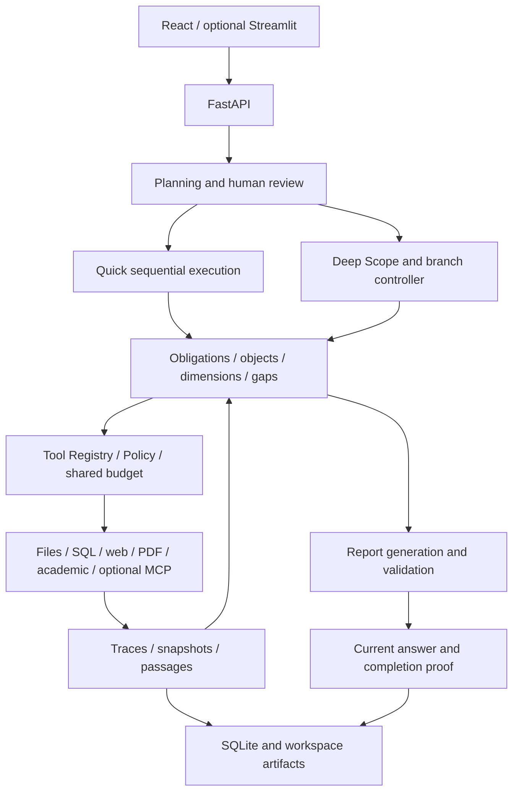

# Traceable Research Agent

**English** | [简体中文](README_zh.md)

A self-hosted research workspace for following an answer from the original
question to its sources, tool calls and final report.

Plan research, inspect evidence, review gaps and export reports through a React
interface or API. FastAPI handles execution and SQLite stores the research history.

[Background](#background) · [Highlights](#highlights) · [Quick start](#quick-start) ·
[Deployment](#deployment-and-startup) · [Demo](#demo) · [Configuration](#configuration) ·
[API](#api) · [Architecture](#architecture)

## Background

A research report is easier to assess when its sources and reasoning can be
inspected. A citation alone does not show whether the source was fully read,
whether an important condition was omitted, or whether every requested question
was answered.

Traceable Research Agent records the work behind the report: the plan, required
answers, research branches, source snapshots, evidence passages, tool failures
and validation decisions. It is intended for technical research, source comparison,
literature investigation and local document/database review.

The application runs as a single self-hosted instance. Sessions and optional
memory belong to that deployment. Remote MCP tools are optional; the core
research workflow runs without them.

## Highlights

| Capability | What it provides |
| --- | --- |
| Quick and Deep research | Quick executes a sequential plan. Deep organizes research into a persistent Scope and tree of branches, sharing the root budget. |
| Inspectable execution | Plans, tool inputs/outputs, timing, failures and recorded usage remain available as Traces. |
| Evidence provenance | Follow a citation through its passage, source snapshot, acquisition Trace and originating Run. |
| Required-answer coverage | Track required answers by object and dimension; missing content creates a specific gap and a targeted next action. |
| Report validation | Check citation support, object identity, applicable conditions and required coverage against the current report. |
| Governed tools | Registered tools include restricted file reads, read-only SQL, web search/fetch, PDF and academic tools, with optional MCP integration. |
| Human control | Review plans, approve protected operations and approve budget increases for a specific Run. |
| Research workspace | Browse tasks, evidence and reports; use sessions, optional memory, capability inspection and runtime diagnostics. |
| Portable reports | Read Markdown in the UI and download Markdown, Word or PDF; export evidence as JSON. |

### How research reaches completion

```text
Research obligations → objects and dimensions → specific gaps
→ targeted actions → completion proof
```

A successfully fetched page supplies candidate evidence. It does not establish
that the requested answer is complete. The controller first considers saved
body passages, then continuation reads, targeted searches or Deep branches.
Writing evidence is selected per object and dimension; unchanged evidence views
avoid repeated model judgement. Final confirmation binds the current answer,
citations and coverage decisions to the saved report.

The workbench distinguishes acquired evidence, candidate answers and confirmed
answers. Missing support can leave a Run `incomplete`, with a readable partial
report. Model-provider failures remain visible. Validation results assist review;
they do not guarantee factual accuracy. Complete real-provider Quick/Deep content
acceptance and human review remain work in progress.

## Quick start

Requirements: Git and Docker Desktop, or Docker Engine with Docker Compose v2.
The commands below use Bash; in PowerShell, use `Copy-Item` instead of `cp`.

### 1. Get the project and choose a configuration

```bash
git clone https://github.com/piao666/traceable-research-agent.git
cd traceable-research-agent
cp .env.example .env
```

For real research, edit `.env` and set:

```dotenv
LLM_BASE_URL=https://your-provider.example/v1
LLM_MODEL=your-model
REACT_LLM_MODEL=your-model
LLM_API_KEY=your-api-key
TAVILY_API_KEY=your-search-key
```

The example uses an API compatible with the configured `openai_compatible`
provider. Set a reachable endpoint and a model your provider serves. Deep uses
the actor settings as well as the report/planner settings.

For a **credential-free local demonstration**, copy `.env.example.offline` to
`.env` instead, before the first startup. It selects deterministic planning and
reports with mock external tools. It does not perform real web research.

### 2. Check networking and start

The current Compose file defaults to a host proxy at
`http://host.docker.internal:7897` for external requests. Configure that proxy,
or use the [direct-network override](#network-and-proxy-setup), before starting
real research.

```bash
docker compose up --build -d api web
docker compose ps
```

Wait for the API to become healthy, then open:

| Entry point | Default URL |
| --- | --- |
| React research workspace | http://localhost:5173 |
| API documentation | http://localhost:8000/docs |
| Health check | http://localhost:8000/health |

### 3. Start your first task

Open **New research**, enter a question, select Quick or Deep, review the plan,
and approve execution. Inspect the workbench, evidence and report tabs as the
task runs. Use the [demo](#demo) below for a first walkthrough without remote keys.

## Deployment and startup

### Services and persistent data

Compose contains three services:

| Service | Role | Default host port |
| --- | --- | --- |
| `api` | FastAPI, tools, research controller and database access | 8000 |
| `web` | React build served by Nginx, proxying API requests | 5173 |
| `streamlit` | Optional alternative UI | 8501 |

Start all three with `docker compose up --build -d`. The API image installs the
API dependencies; the optional Streamlit image adds its own dependencies.
The API entrypoint applies migrations and initializes the demo database only
when absent. Set `DOCKER_INIT_DEMO_DATA=false` to disable demo initialization.

| Storage | Location in a default Compose deployment |
| --- | --- |
| Run, Trace and research-state SQLite database | `traceable_db` named volume, mounted at `/app/data` |
| Evidence artifacts, reports, local inputs and demo database | Host `workspace/`, mounted at `/app/workspace` |
| Credentials and local settings | Host `.env` |

Back up both the database volume and `workspace/` before upgrading, preferably
while services are stopped. `docker compose down` stops services and preserves
these data; `down -v` removes the named volume.

```bash
docker compose logs --tail 100 api
docker compose logs --tail 100 web
docker compose down
```

After pulling new code, run `docker compose up --build -d api web` to rebuild
and start it. After editing `.env` only, use
`docker compose up -d --force-recreate api` to apply settings. A simple restart
does not rebuild the image or reload changed Compose environment values.

### Network and proxy setup

Use `.env` values `DOCKER_HTTP_PROXY`, `DOCKER_HTTPS_PROXY` and
`DOCKER_SSRF_TRUSTED_PROXY_URL` to point to a reachable host proxy.
`DOCKER_NO_PROXY` controls exclusions. An empty value does not disable the
defaults because Compose uses `${VARIABLE:-default}` interpolation.

If no proxy is needed, create a local `compose.direct.yml`:

```yaml
services:
  api:
    environment:
      HTTP_PROXY: ""
      HTTPS_PROXY: ""
      SSRF_TRUSTED_LOCAL_PROXY_URL: ""
```

Start with the override and include it in subsequent Compose commands:

```bash
docker compose -f docker-compose.yml -f compose.direct.yml up --build -d api web
```

Image builds use Docker's own download/proxy settings. If a build fails, inspect
its output and Docker networking, then retry the affected build. The API's
runtime proxy settings do not configure image downloads.

### Run from source

For development, use Python 3.11+ and Node.js 20+. From the repository root,
choose and edit `.env` as above, then create a virtual environment:

```bash
python -m venv .venv
source .venv/bin/activate
python -m pip install -r requirements.txt
python scripts/migrate_database.py
python scripts/init_demo_db.py
python -m uvicorn app.main:app --host 127.0.0.1 --port 8000
```

On Windows PowerShell, activate with `.\.venv\Scripts\Activate.ps1`.
Start the React UI in another terminal:

```bash
cd web
npm ci
npm run dev
```

Vite proxies `/api` and `/health` to port 8000. For the alternative UI, run
`streamlit run frontend/streamlit_app.py` from the root with the environment
activated. Windows also provides `start_traceable_demo.bat --check` and
`start_traceable_demo.bat` for API/Streamlit startup; `--with-mcp` adds the
optional local MCP Source Pack. These scripts do not start React.

## Demo

### Local documents and SQL, without remote keys

Use the offline configuration on a fresh deployment and leave demo initialization
enabled. The included `workspace/docs/demo_research_note.md` and `demo.sqlite`
provide small local inputs. This PowerShell walkthrough creates a plan for
registered file/SQL tools:

```powershell
$api = "http://localhost:8000"
$body = @{
  task = "Read local docs demo_research_note.md and query database: SELECT id, title, category FROM documents"
  report_type = "summary"
  research_mode = "quick"
  source_mode = "mock"
  skill_name = "none"
  allowed_tools = @("file_reader", "sql_query", "report_writer")
  require_plan_approval = $true
} | ConvertTo-Json

$created = Invoke-RestMethod -Method Post -Uri "$api/api/tasks" `
  -ContentType "application/json" -Body $body
$runId = $created.run_id
Invoke-RestMethod "$api/api/tasks/$runId/review"
```

Inspect the returned plan, then approve and read the result:

```powershell
$approval = @{ approved = $true; comment = "Reviewed local demo plan" } | ConvertTo-Json
Invoke-RestMethod -Method Post -Uri "$api/api/tasks/$runId/approve-plan" `
  -ContentType "application/json" -Body $approval
Invoke-RestMethod "$api/api/tasks/$runId"
Invoke-RestMethod "$api/api/tasks/$runId/trace"
Invoke-RestMethod "$api/api/reports/$runId"
```

The same Run is visible at `/runs/{run_id}` in React. Follow its file/SQL calls,
evidence and report. This deterministic demo demonstrates execution and
persistence; strict answer validation can leave it `incomplete` with a partial
report. That is distinct from a fully validated online research result.

### Real web research

With model and search credentials configured, open **New research** and try:

> Explain the conditions and tradeoffs of database write-ahead logging. Cover
> concurrency, checkpoints, network filesystems and failure recovery. Cite primary sources.

Use Quick for a scoped first pass and Deep for decomposed, multi-source work.
Select **real** sources, inspect the plan, then approve it. Check each required
dimension in the work panel and follow citations back to the original passages.
Review any partial result or budget request before continuing. These operations
use your configured providers and consume their quotas.

## Configuration

`.env.example` contains the main real-research settings;
`.env.example.full` lists advanced settings; `.env.example.offline` supplies
the demonstration profile. Explicit environment settings override profile
defaults. Keep `.env` and provider credentials local.

| Setting | Purpose / example |
| --- | --- |
| `RESEARCH_PROFILE` | `deep`, `standard` or `offline`; runtime defaults, separate from a task's Quick/Deep choice |
| `LLM_PROVIDER`, `LLM_BASE_URL`, `LLM_MODEL`, `LLM_API_KEY` | Planner/report model connection; the real example uses `openai_compatible` |
| `REACT_LLM_PROVIDER`, `REACT_LLM_MODEL` | Deep actor model settings |
| `TAVILY_API_KEY` | Real web-search credentials |
| `DEEP_RESEARCH_ENABLED`, `REACT_ENABLED` | Both must be enabled for Deep execution |
| `RESEARCH_MAX_TOOL_CALLS` | Shared root/branch tool limit; Deep profile default 80 |
| `RESEARCH_MAX_LLM_CALLS` | Shared logical model-call limit; Deep default 192 |
| `RESEARCH_MAX_TOKENS` | Shared Token limit; Deep default 400000 |
| `RESEARCH_MAX_SECONDS` | Shared elapsed-time allowance; Deep default 1800 seconds |
| `FETCH_BROWSER_ENABLED` | Enable dynamic-page browser fallback; example default `false`, requires runnable Chromium |
| `FETCH_REMOTE_EXTRACT_ENABLED` | Enable a configured remote extraction backend; example default `false` |
| `FILE_READER_ALLOWED_ROOTS` | Allowed local inputs; default `workspace/docs` |
| `DOCKER_INIT_DEMO_DATA` | Initialize a missing demo database; default `true` |
| `AUTH_ENABLED`, `DEMO_API_KEY` | Optional API-key authentication; default disabled |

New obligation runs reaching hard Token or model-call limits can pause at
`waiting_human`. Approve a higher `max_tokens`, `unlimited_tokens: true`, or a
higher finite `max_llm_calls` for that specific Run. Token approval does not
increase tool, model-call, time or cost limits. Existing usage and evidence are
retained; report finalization reserves capacity inside the same total budget.

With API authentication enabled, send `X-API-Key` or a Bearer credential.
The current React UI does not collect credentials and assumes the local default
configuration; protected deployments must supply authenticated access separately.

## API

Interactive request/response schemas are available at `/docs` and
`/openapi.json` on the API server.

| Method and path | Purpose |
| --- | --- |
| `GET /health` | Service health |
| `GET /api/runtime/capabilities` | Configured capabilities; does not prove provider connectivity |
| `GET /api/runtime/diagnostics` | Local runtime/database diagnostics |
| `POST /api/runtime/preflight` | Explicit real provider probes; consumes provider quota |
| `POST /api/tasks` | Create a task and persisted plan |
| `GET /api/tasks` | List/filter tasks |
| `GET /api/tasks/{run_id}` | Status, progress and recorded usage |
| `GET /api/tasks/{run_id}/plan` | Plan, budget and research work state |
| `GET /api/tasks/{run_id}/review` | Plan awaiting review |
| `POST /api/tasks/{run_id}/approve-plan` | Approve/edit/reject a plan; approval starts execution |
| `POST /api/tasks/{run_id}/run_async` | Start a pending task in the background |
| `POST /api/tasks/{run_id}/confirm` | Approve/reject protected operations or budget changes |
| `POST /api/tasks/{run_id}/cancel` | Cancel a task |
| `POST /api/tasks/{run_id}/retry` | Create a new retry Run |
| `GET /api/tasks/{run_id}/trace` | Persisted tool calls |
| `GET /api/tasks/{run_id}/events` | Server-sent progress events |
| `GET /api/tasks/{run_id}/result/evidence` | Evidence at the visible Run/Scope boundary |
| `GET /api/tasks/{run_id}/result/trace` | Trace across the result's research branches |
| `GET /api/tasks/{run_id}/research-tree` | Deep research tree |
| `GET /api/tasks/{run_id}/evidence/export/download?format=json` | Download evidence |
| `GET /api/reports/{run_id}` | Report content and availability |
| `GET /api/reports/{run_id}/download?format=markdown` | Download; also accepts `docx` and `pdf` |
| `GET /api/tools`, `GET /api/skills` | Registered tools and task definitions |

Creating a task does not execute it. If `require_plan_approval=true`, inspect
and approve its plan; otherwise call the run endpoint. Session, memory and
quality-statistics APIs are also described in OpenAPI.

## Architecture


```mermaid
flowchart TD
    UI[React / optional Streamlit] --> API[FastAPI]
    API --> Plan[Planning and human review]
    Plan --> Quick[Quick sequential execution]
    Plan --> Deep[Deep Scope and branch controller]
    Quick --> Work[Obligations / objects / dimensions / gaps]
    Deep --> Work
    Work --> Tools[Tool Registry / Policy / shared budget]
    Tools --> Inputs[Files / SQL / web / PDF / academic / optional MCP]
    Inputs --> Evidence[Traces / snapshots / passages]
    Evidence --> Work
    Work --> Report[Report generation and validation]
    Report --> Proof[Current answer and completion proof]
    Evidence --> Store[SQLite and workspace artifacts]
    Proof --> Store
```

```text
Citation → Passage → Source Snapshot → Trace → originating Run
```

Source body artifacts, bounded writing windows and citation occurrences retain
their identities and hashes. Deep aggregates branch evidence without changing
its originating Run/Trace. Revisions reevaluate coverage; deleting required
answers does not remove the underlying research obligation.

```text
app/api/        HTTP endpoints and contracts
app/agent/      Planning, dispatch, shared budgets and reporting
app/research/   Scope/tree, work controller, gaps and coverage
app/retrieval/  HTTP/browser/remote/PDF acquisition routing
app/tools/      Registered tool implementations
app/evidence/   Source artifacts, provenance and citation validation
app/reporting/  Evidence projection, claim occurrences and revision pipeline
app/trace/      Run and tool-call persistence
app/memory/     Sessions and optional local memory
app/skills/     Reusable task definitions
app/mcp/        Optional MCP integration
web/            React / TypeScript / Vite frontend
frontend/       Alternative Streamlit frontend
migrations/     Alembic database migrations
scripts/        Startup, demonstrations and validation
workspace/      Local inputs, evidence artifacts and reports
```

Tools run through the registry and policy boundary. File reads are restricted
to configured roots; SQL is read-only with row limits; network operations have
timeouts and trace redaction. High-risk operations require confirmation.
The project does not include tenant isolation, vector indexing or a RAG service.

## Development and validation

With the development dependencies installed:

```bash
python -m compileall -q app scripts frontend migrations tests
python scripts/run_offline_tests.py --runner pytest
python scripts/smoke_research_integrity.py
docker compose config --quiet
cd web
npm run typecheck
npm run lint
npm test
npm run build
```

The offline test runner and API smoke use disposable local data. They do not
establish real-provider answer quality. See [release validation](RELEASE_VALIDATION.md)
for acceptance boundaries and [engineering rules](AGENTS.md) for contribution
constraints. Do not commit credentials, runtime databases or generated reports.

## License

The repository currently has no root `LICENSE` file. Licensing remains to be
specified; this README is not a license.
