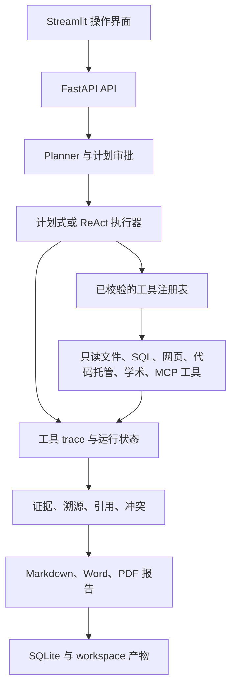

# Traceable Research Agent

[](#快速开始)
[](#快速开始)

**Traceable Research Agent** 是一个可自托管的调研应用，面向需要追溯
结论形成过程的团队。它为任务生成多步计划，只执行已注册的只读工具，将每次
调用和失败持久化为 trace，并生成带证据依据的 Markdown 报告。

[English](README.md) | [快速开始](#快速开始) | [API](#api) | [架构](#架构)

## 核心亮点

### 研究可信性修复（R0–R3）

工具返回成功不等于研究完成。缺少必要配置时，系统保留草稿并阻止执行。
`GET /api/runtime/capabilities` 只披露脱敏配置状态；
`GET /api/tasks/{run_id}/preflight` 按实际计划检查，不代表联网验证通过。

- 本地文件／SQL 计划不要求搜索或模型密钥，除非显式要求 LLM 模式。
- 上游空结果会跳过依赖抓取；零有效证据、必需抓取或必需步骤失败不能完成
  研究。部分失败明确显示限制；显式 LLM 报告合成失败不能静默降级为规则报告。
- 错误、审批、记忆召回和模型结束摘要保留在 Trace，但不计作研究来源。
  搜索摘要与网页正文分开统计；引用校验只检查最终回答，不把引用索引中的
  来源原文当作研究结论。零引用显示不可评估，禁止按编号相近替换无效引用。
- 完整重试创建新 Run、读取当前配置并重新审批；取消不会被迟到的完成状态覆盖。
- 历史报告和 Trace 不删除、不静默重写；旧结果显示待复核，旧质量记录不再
  纳入可信趋势和路由学习。执行中的证据变更采用追加版本并隔离旧版统计。

“深度 Web 模板”“ReAct 模式”“DEEP_RESEARCH_ENABLED 多轮深化”是三个不同设置；
多轮深化只作用于 ReAct。各轮学习笔记是待核验内容，不等于已支持结论，需查看
关联子任务。目前 D01–D11 均已接入真实接口；R6 统一状态、响应式与键盘／焦点
改动已在本地实施，浏览器视觉与当前 Figma 对照尚未验证。R7 可执行回归与部署
准备见[发布验证清单](RELEASE_VALIDATION.md)；完整 pytest、Docker／Streamlit
实际运行、浏览器和真实联网验收仍未全部完成。

### 统一页面状态与可访问性（R6）

指标尚未读取时显示 `—`，不伪装成零；任务与健康接口独立处理失败并提供重试。
计划复核支持读取恢复，未取得明确就绪的预检结果不能批准，冲突后同步最新状态；
区分“正在批准”和“正在拒绝”，离开旧任务后忽略迟到响应。浏览器禁用存储时，
不崩溃也不声称草稿已保存。

共享原生弹窗统一说明、初始焦点、关闭后焦点恢复及忙碌保护；补齐跳过导航、
路由标题／焦点、状态标签页方向键和 Home/End 操作。引用与 Trace 跳转聚焦
精确目标，刷新不抢焦点；表格及滚动数据块可键盘访问，外链提示新窗口。
窄屏任务改为带字段名卡片，长文本与按钮可换行，并增加减少动效和文字颜色对比检查。

在 `web/` 执行 `npm run typecheck`、`npm run lint`、`npm test`、`npm run build`。
`node qa/smoke.mjs` 检查隔离样本服务；
`npm run dev -- --config qa/vite.config.ts` 启动 `/qa/viewport.html`，用于桌面／390px
人工走查。该服务禁用 API 代理、固定使用同源样本并拒绝所有写入，不进入生产构建。
参见[走查说明](web/qa/README.md)与[设计映射限制](web/README.md)。
模拟 DOM 测试不等于实际排版、原生弹窗焦点限制、读屏体验或完整可访问性达标；
这些验证和真实联网验收均单列，最终验收仍在 R6–R7 之后进行。

### 本地模块（R5 / D08–D11）

- 会话 `/sessions`：创建、重命名、查看持久化轮次与分页关联任务；在同一会话
  发起后续研究，传递 `session_id` 并隔离浏览器草稿，仍需计划审批。不存在的
  会话在创建 Run 前被拒绝。会话关联不等于向规划器自动注入全部历史正文，
  请在后续问题中写明所需背景。
- 记忆 `/memory`：筛选待确认、生效、已过期、已替代状态；可追踪来源，
  确认生效、拒绝并删除、单条删除。清空全部状态需要输入确认短语，不能误认为
  只清当前筛选。删除不可恢复，但保留源会话、任务和报告。过期状态即时判断，
  不重写历史行；过期记忆不参与召回。未启用模型提取时规则提取可能仍运行，
  不保证每次研究都生成记忆。
- 迁移 `0010_memory_audit` 新增不含记忆正文的操作审计表；确认、拒绝、删除、
  清空与审计在同一事务提交，审计失败则回滚操作。`GET /api/memory/audit`
  查看近期动作；它不是研究证据，也不会补造历史删除记录。
- 能力 `/capabilities`：工具清单、风险、确认要求、输入输出约束及 Skill
  定义和依赖。已注册、已配置与执行成功分开说明；远程 MCP 可选。不提供
  工具执行按钮或浏览器密钥编辑功能。
- 系统 `/system`：`GET /api/runtime/diagnostics` 实测数据库读取及模块表，
  检查工作目录与读写权限，不做写入探测或外部请求。质量窗口、每日趋势和
  单任务明细沿用可信结果门槛；零记录显示不可评估，启发式分数不是事实准确率。

R5 无密钥检查：`python -m unittest tests.test_r5_modules tests.test_memory`；
`python scripts/smoke_research_integrity.py` 使用一次性 SQLite 验证 API 重启后
会话、记忆和审计保留，不调用外部服务。只有部署启动时才对部署数据库应用
新迁移；部署前请备份持久化数据。代码与模拟测试不代替浏览器、容器和真实联网验收。

### 研究主流程（R4 / D05–D07）

- 工作台 `/runs/{id}`：读取持久化状态、计划、Trace 输入输出、失败原因、
  累计耗时及已记录的估算费用。启动、取消、人工确认／拒绝、完整重试均需
  明确操作；重试创建新 Run，但不自动启动。批准计划后直接进入对应工作台。
- 证据 `/runs/{id}/evidence`：查看来源与片段、摘要／全文标识，以及引用→
  结论→片段→来源／Trace 的实际关联。缺失或冲突编号不自动匹配；可导出
  分组来源与片段 JSON。关联存在不等于事实已核实。
- 报告 `/runs/{id}/report`：读取和下载 Markdown，引用跳转对应证据；区分
  未生成、文件丢失和研究未通过。安全阅读支持标题、列表、表格、代码和
  HTTP(S) 链接，不执行原始 HTML、不加载外部图片；复杂格式可下载原文查看。
- 运行中使用可恢复 SSE 并每 5 秒同步 HTTP 快照；等待人工时仅轮询，终态
  关闭连接。Nginx 禁用事件缓冲。任务列表改为服务端筛选、搜索和分页：
  `status=waiting` 包含两种待审批状态，`q` 搜索任务文本／Run ID。
  SQLite 无时区偏移的时间按 UTC 解释，再转为浏览器本地时间显示。
- 人工确认支持 `POST /api/tasks/{id}/confirm?start_async=true`，原同步方式
  保持兼容；报告响应新增 `availability`，取值为 `available`、
  `not_generated`、`missing`、`blocked`。

无密钥检查：`python -m unittest tests.test_r4_workflow`；在 `web/` 执行
`npm run typecheck`、`npm run lint`、`npm test`、`npm run build`。
这些检查不等于真实联网或浏览器视觉验收。R5–R7 完成后再统一进行部署和
密钥配置后的最终验收；不能只凭 Markdown 或 `completed` 认定通过。

在实际部署目录修改 `.env` 后，执行 `docker compose up -d --force-recreate api`
使环境变量生效，再重新检查计划。仅修改密钥不需要重建镜像；前端不收集密钥。

仓库根目录验证命令：

```bash
python -m unittest tests.test_research_integrity -v
python scripts/smoke_research_integrity.py
python -m pytest tests
```

冒烟脚本使用独立临时数据库和本地 API，验证缺密钥阻塞与重启后草稿保留，不调用
外部服务。配置密钥后的真实联网研究、实际报告质量和 Docker 启动需另行验收。

- **执行过程可检查**：任务计划、运行状态、进度、工具输入输出、错误、延迟和
  成本估算都会写入 SQLite。
- **默认只读**：本地文件、SQL、网页、代码托管、学术检索和 MCP 工具必须先在
  注册表中显式登记，并在执行前校验。
- **人工掌控**：计划可以暂停并等待审批；受保护的操作也必须经过明确确认，
  不会在后台静默执行。
- **证据优先的报告**：报告旁可查询引用、溯源、来源内容基础、冲突和引用校验
  指标。
- **受治理的调研输入**：检索 profile 会执行信源层级配额、有界候选与抓取预算，
  并将定向补搜写入可审计 trace。
- **本地提取管道**：HTML 多级降级提取、完整性校验缓存、PDF 页级证据和文献
  存在性校验均通过同一套可追溯工具边界运行。
- **无需远程服务也可运行**：确定性规划和本地工具支持离线友好的审计流程；
  网络搜索与 LLM 综合均为可选增强。
- **一条命令部署**：Docker Compose 同时启动 FastAPI 和 Streamlit，运行数据
  保存在挂载的 `workspace/` 目录中。

## 演示

最短演示只使用本地数据：创建三步计划，读取受限目录中的文档，执行只读 SQL
查询，并生成可追溯报告。

```powershell
$body = @{
  task = "审计本地研究说明和文档元数据"
  report_type = "summary"
  source_mode = "mock"
  skill_name = "local_audit"
  require_plan_approval = $true
} | ConvertTo-Json

$created = Invoke-RestMethod -Method Post -Uri http://localhost:8000/api/tasks `
  -ContentType application/json -Body $body

Invoke-RestMethod -Method Get `
  -Uri "http://localhost:8000/api/tasks/$($created.run_id)/review"

$approval = @{ approved = $true; comment = "审批通过" } | ConvertTo-Json
Invoke-RestMethod -Method Post `
  -Uri "http://localhost:8000/api/tasks/$($created.run_id)/approve-plan" `
  -ContentType application/json -Body $approval

Invoke-RestMethod -Method Get `
  -Uri "http://localhost:8000/api/tasks/$($created.run_id)/trace"
```

运行状态会从 `waiting_human_plan` 变为 `completed`。trace 中包含
`memory_recall`、`plan_approval`、本地工具调用和 `citation_validator`。
报告可通过 `GET /api/reports/{run_id}` 获取。

若要运行真实网页调研，请配置 `TAVILY_API_KEY` 后执行：

```powershell
.\.venv\Scripts\python.exe scripts\demo_real_research.py --preset 1 --report-type detailed_report
```

该脚本执行搜索、抓取、证据压缩和报告生成。输出保留在本地的
`docs/examples/`，默认不会作为公开内容发布。

## 快速开始

前置条件：Docker Desktop，或安装了 Compose v2 的 Docker Engine。

```powershell
git clone https://github.com/piao666/traceable-research-agent.git
Set-Location traceable-research-agent
Copy-Item .env.example .env
docker compose up --build -d
```

若只使用 React 前端，执行 `docker compose up --build -d api web`。
`api` 镜像只安装 `requirements/api.txt`，不下载 Streamlit、PyArrow、Pandas、
NumPy、PyDeck 或 pytest。可选的 `streamlit` 镜像再安装
`requirements/streamlit.txt`；旧的 `light` Docker target 仍保留两套运行依赖。
本地开发仍可执行 `pip install -r requirements.txt`，其中也包含
`requirements/dev.txt` 的测试依赖。

### 依赖下载中断后的恢复

Docker 会先将容器内 pip 固定到 **26.2.1**，再安装应用依赖：连接尝试 5 次，
不完整下载恢复尝试 10 次，socket 超时 120 秒。BuildKit 缓存 pip 下载文件，
缓存不进入最终镜像；保留下载哈希校验与 TLS 验证。
配置依据：[pip 下载参数](https://pip.pypa.io/en/stable/cli/pip/)、
[Docker 缓存挂载](https://docs.docker.com/build/cache/optimize/#use-cache-mounts)。
此次保留了直接依赖的精确版本，但尚不是完整的传递依赖锁文件。

同步修复提交后，在仓库或预览 worktree 根目录执行以下 PowerShell 命令。
每一步成功后才继续下一步，只重建失败的 API 镜像：

```powershell
docker compose --progress plain build api
if ($LASTEXITCODE -ne 0) { throw "API 构建失败，请停止并检查下载错误。" }
docker compose up -d --no-build api web
if ($LASTEXITCODE -ne 0) { throw "启动失败，请检查 docker compose logs api。" }
docker compose ps
```

上述恢复命令要求同一个 Compose 项目已有构建成功的 web 镜像；全新环境使用
`docker compose up --build -d api web`。不要加 `--no-cache`、清空全部 Docker
缓存、关闭哈希校验，或将失败下载的哈希填回配置。如果仍失败，应检查 Docker
Desktop 的代理与包下载链路；增大超时不能修复异常代理。
升级 Windows 本机 pip 不会升级 Docker 镜像中的 pip。

API 容器启动时自动执行数据库迁移，仅在演示数据库不存在时初始化。
已有演示库（包括未知或损坏文件）保持原样，不自动清空或修复；
`DOCKER_INIT_DEMO_DATA=false` 可关闭初始化。升级前应停止服务并备份 workspace，
详见[发布验证清单](RELEASE_VALIDATION.md)。API healthy 后，
可以访问：

- Streamlit：<http://localhost:8501>
- React web（D01–D11）：<http://localhost:5173>
- FastAPI 文档：<http://localhost:8000/docs>
- 健康检查：<http://localhost:8000/health>

查看服务状态和日志：

```powershell
docker compose ps
docker compose logs --tail 100 api
docker compose logs --tail 100 streamlit
```

运行时数据库、报告和证据产物都位于 `workspace/`，该目录会挂载到两个服务中。
以下命令只停止应用，不会删除这些本地数据：

```powershell
docker compose down
```

若使用 Windows 本地虚拟环境，根目录启动脚本会根据自身位置自动解析项目路径，
并启动 FastAPI 与 Streamlit：

```powershell
.\start_traceable_demo.bat --check
.\start_traceable_demo.bat
```

核心应用不依赖 MCP。若需要同时在 9001 端口启动可选 MCP Source Pack，请使用
`start_traceable_demo.bat --with-mcp`。
默认端口不可用时，可在运行脚本前设置 `TRACEABLE_API_PORT`、
`TRACEABLE_STREAMLIT_PORT` 或 `TRACEABLE_MCP_PORT`。

## 配置

复制 `.env.example` 为 `.env`，其中包含全部可配置项。`.env` 只供本地使用，
绝不能提交。

| 设置 | 默认值 | 用途 |
|---|---|---|
| `AUTH_ENABLED` | `false` | 启用本地 API Key 认证。 |
| `DEMO_API_KEY` | 空 | 认证启用时所需的 API Key。 |
| `EXECUTION_MODE` | `planned` | 选择稳定的计划式执行或 `react`。 |
| `OFFLINE_MODE` | `false` | 禁用远程工具，适用于离线环境。 |
| `REPORT_GENERATION_MODE` | `deterministic` | 选择离线安全报告或已配置的 LLM 报告。 |
| `TAVILY_API_KEY` | 空 | 启用真实网页搜索。 |
| `QWEN_API_KEY` / `DEEPSEEK_API_KEY` | 空 | 启用可选的 LLM Provider。 |
| `FILE_READER_ALLOWED_ROOTS` | `workspace/docs` | 本地文件读取的受限根目录。 |
| `CITATION_VALIDATION_LLM_ENABLED` | `false` | 启用可选的 LLM 二次引用校验。 |

远程密钥不是必需项。本地演示和确定性报告路径无需配置任何远程密钥。
当 `AUTH_ENABLED=true` 时，请将密钥放入 `X-API-Key` 请求头，或使用
Bearer 凭据。

## API

| 端点 | 用途 |
|---|---|
| `GET /health` | 查询服务与数据库就绪状态。 |
| `POST /api/tasks` | 创建计划式调研任务。 |
| `GET /api/tasks/{run_id}` | 查询状态、进度、成本和引用指标。 |
| `POST /api/tasks/{run_id}/run` | 执行已创建任务。 |
| `GET /api/tasks/{run_id}/review` | 获取等待审批的计划。 |
| `POST /api/tasks/{run_id}/approve-plan` | 批准、编辑或拒绝计划。 |
| `POST /api/tasks/{run_id}/confirm` | 恢复或拒绝受保护的操作。 |
| `GET /api/tasks/{run_id}/trace` | 查询持久化的工具 trace。 |
| `GET /api/tasks/{run_id}/evidence/v2` | 查询溯源和引用。 |
| `GET /api/reports/{run_id}` | 获取 Markdown 报告。 |
| `GET /api/tools` | 列出已注册工具元数据。 |
| `GET /api/skills` | 列出已安装的任务 Skill。 |
| `GET /api/improvement/stats` | 按真实日期窗口查询最终运行质量统计。 |
| `GET /api/improvement/runs/{run_id}` | 查询单次运行的五维最终质量评分。 |
| `GET /api/improvement/state` | 查询本地路由权重和 Few-shot 冷启动状态。 |

计划与任务状态响应会公开多 Skill 组合及 Planned→ReAct 自适应深化元数据。
在质量门或深度研究仍未结束时，实时连接不会提前关闭；只有最终报告稳定后
才会发送 `report_ready`。

`/docs` 提供完整的 OpenAPI 请求和响应参考。

## 架构



```text
app/api/       FastAPI 端点与响应契约
app/agent/     计划、执行、报告生成和安全护栏
app/tools/     已注册的只读工具实现
app/trace/     run 与工具调用持久化
app/evidence/  溯源、引用和冲突推理
app/memory/    单实例会话与可选记忆
app/skills/    可复用任务定义与校验
app/mcp/       可选的只读 MCP 集成
frontend/      Streamlit 界面
migrations/    Alembic Schema 历史
scripts/       迁移、演示、smoke 与评测命令
workspace/     本地数据库、报告、产物与 Skill
```

## 安全模型

- 执行器只能调用统一注册表中存在的工具。
- `file_reader` 解析路径、阻断目录穿越和逃逸软链接、限制读取长度，并只读取
  已配置根目录下的文件。
- `sql_query` 只接受一条只读 `SELECT` 或 `WITH` 语句，并强制结果行数上限。
- 外部与 MCP 集成均为只读，带超时限制，并从 trace 中脱敏密钥。
- 失败和拒绝的调用也会保留在运行状态与 trace 中。
- 计划审批和高风险工具确认都是显式状态流转，不会隐藏为后台操作。

## 质量验证

当前注册表包含 **12 个只读工具**。旧阶段测试数字不能作为 R0–R7 修复的验收。
R7 离线 unittest 发现 479 项：467 项通过，12 项因缺 pytest／Streamlit 导入报错；
修正固定测试数据后，外部网络尝试为零。**这不是完整 pytest 通过。**
前端 93 项测试、类型检查、Lint、构建通过，隔离走查服务 52 项检查通过。
剩余限制见[发布验证清单](RELEASE_VALIDATION.md)。

本地运行核心检查：

```powershell
.\.venv\Scripts\python.exe -m compileall -q app scripts frontend migrations tests
.\.venv\Scripts\python.exe scripts\run_offline_tests.py --runner pytest
.\.venv\Scripts\python.exe scripts\smoke_research_integrity.py
docker compose config --quiet
```

## 路线图

- [x] 可追溯的计划式执行和可选 ReAct 执行
- [x] 证据溯源、引用校验和人工计划审批
- [x] 信源分层治理、缓存提取、PDF 证据与学术文献校验
- [x] Docker 部署配置与本地运行数据持久化实现
- [ ] R0–R7 真实 Docker 构建／重启、Streamlit 与浏览器验收
- [ ] 在公开再分发前补充仓库许可证
- [ ] 为长时间运行的自托管实例扩展运维可观测性

## 贡献

欢迎提交 Issue 和聚焦的 Pull Request。请遵守项目边界，保持工具只读保证，
为行为变化补充针对性测试，并且不要提交 `.env`、本地数据库、生成报告或其他
本地运行数据。工程规则见 [AGENTS.md](AGENTS.md)。

## 许可证

当前仓库没有根目录 `LICENSE` 文件。在许可证加入前，本 README 不授予使用、
复制、修改或再分发代码的许可。将项目作为公开开源发行版前，请先添加明确的
许可证。

## 参考

这是独立实现。外部 Agent 系统材料只作为只读设计参考，仓库中不复制外部项目
源代码。
