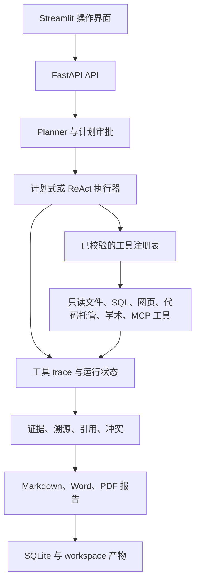

# Traceable Research Agent

[](#快速开始)
[](#快速开始)

**Traceable Research Agent** 是一个可自托管的调研应用，面向需要追溯
结论形成过程的团队。它为任务生成多步计划，只执行已注册的只读工具，将每次
调用和失败持久化为 trace，并生成带证据依据的 Markdown 报告。

[English](README.md) | [快速开始](#快速开始) | [API](#api) | [架构](#架构)

## 核心亮点

### Deep Research Engine V2（R12）

Deep Profile 现在只有一条正式执行链：一个持久化 Research Scope 包含 Root 与各研究
分支组成的 Research Tree。`AgentRun` 正式记录 `parent_run_id`、`root_run_id`、
`run_role`、`research_scope_id` 和 `engine_version`；迁移
`0012_research_scope_and_lineage` 会保守回填旧 Run，运行时不再把 `plan_json` 当作
lineage 权威来源。

每个节点继续复用已有的受治理 ReAct Executor、只读 Tool Registry、恢复策略、Trace、
Evidence Pipeline 与根 Run 共享预算。子 Run Evidence 仍归属于原子 Run，只通过只读
Scope 聚合层进入整体完成判定和最终报告，因此完整保留
`Citation → Passage → Snapshot → Trace → origin_run_id`。Root 只生成一次基于整个 Scope
的最终报告；节点完成时不会再先生成遗漏兄弟分支证据的中间报告。Standard 与 Offline
继续沿用原执行路径。

旧 `app.agent.deepening.run_deepening` 名称仅保留一个兼容周期，调用时发出弃用告警并
转入 Engine V2；Dispatcher 已不再调用旧 Round 引擎。Coverage／Gap Intelligence 与
分章节长报告仍严格留在 R13／R14。

### Scope-first 研究结果治理（R12.1）

R12.1 只收口仍残留的 Run-centric 问题，不提前实现 R13 Research Intelligence。
`ResearchResultContext` 会把普通 Run，或 Deep Research Scope 中任意成员 Run，统一
解析为一个用户可见结果边界。正式 Result API、React 证据／报告页面与证据导出因此
都能读取 Root、Child、Grandchild 的完整 Evidence，同时保留每个实体的
`origin_run_id`、`origin_trace_id` 与 `research_node_id`。

Scope Identity 在不删除原始溯源的前提下提供稳定的 Source／Passage Alias 和有效唯一
计数；跨 Run Claim 归组、来源独立性与冲突判定会持久化并进入最终合成。最终回答会
落为 Report Claim 与 Citation Occurrence，每个引用标记都独立校验；固定的 Report
Integrity Gate 不通过时，Deep Research V2 不得标记完成。学术校验只处理最终回答
实际引用的 Work，并计入 Root 共享预算。迁移 `0013_research_result_governance` 新增
Scope Reasoning、Report Revision 与 Occurrence 记录。Actor／Synthesizer 可用性保持
分角色判断，最终合成使用有界且兼顾各 Scope 分支的证据上下文。

### 自适应抓取与来源可靠性（R11）

R11 保留外部 `web_fetcher` 工具契约，并将内部实现替换为自适应抓取路由。系统先使用
成本最低的静态 HTTP；HTTP 状态成功后仍必须通过正文质量门。JavaScript 空壳、
Cloudflare／Bot challenge、CAPTCHA、Cookie／登录墙、软 404／429、付费墙、PDF
原始二进制及低质量模板不会再冒充研究正文。符合恢复条件时，同一次工具调用会转入
隔离且不持久化的 Playwright Context，再按配置尝试 Firecrawl／Exa；PDF URL 或
检测出的 PDF 内容则交给现有的页级 PDF Reader。

HTTP、Browser、PDF 与 Remote Extract 统一返回 `FetchResult`，保存请求／最终／
Canonical URL、稳定状态、Provider、提取方法与置信度、重定向链、正文范围、内容哈希
和来源身份。Canonical URL 与内容哈希两级去重，防止等价页面被重复请求或作为多个
独立证据入库。上述元数据同时进入 Trace、`SourceDocument` 与 `SourceSnapshot`；
Agent Recovery 只处理最终的 URL 级结果，不再反复调用静态 HTTP。

高级开关、阈值和 Provider 顺序仅记录在 `.env.example.full`；Docker 会安装固定版本的
Playwright Chromium。真实静态页、Browser、PDF 与已配置远端提取器的 Smoke 必须
显式确认后执行：

```powershell
.\.venv\Scripts\python.exe scripts\validate_real_runtime.py --confirm-real-calls --r11-fetch-smoke
```

离线测试使用注入的 HTTP／Browser／Provider fixture，不会发起真实外网请求。R11
自身仍只是抓取层；R12 直接消费统一 Fetch 结果，不与具体抓取 Backend 耦合。

### 真实运行档位与预检（R10）

R10 用 `RESEARCH_PROFILE` 把真实研究与离线测试明确分开；显式环境变量仍可覆盖
档位默认值：`deep` 默认采用动态 ReAct、LLM 规划／报告、多轮深化以及更宽松的
共享安全上限；`standard` 用较低成本执行真实搜索、抓取和 LLM 报告；`offline`
只用于开发、CI 与演示，采用 deterministic 和显式模拟来源。

普通部署只需在复制 `.env.example` 后填写以下最小配置：

```env
RESEARCH_PROFILE=deep
LLM_PROVIDER=openai_compatible
LLM_BASE_URL=https://example.com/v1
LLM_MODEL=your-model
LLM_API_KEY=your-key
SEARCH_PROVIDER=tavily
TAVILY_API_KEY=your-key
```

底层统一使用 OpenAI-compatible Chat Completions；旧 `qwen`、`deepseek` 名称仍作为
带默认地址和模型的兼容别名。模型错误统一分类为认证、权限、限流、超时、模型不存在、
上下文溢出、响应损坏和结构化输出无效等类型：不可重试的配置错误立即停止，暂时错误
有界退避，上下文溢出只用更小观察窗口重试一次，ReAct 会把原始分类写入 Trace。

`GET /api/runtime/capabilities` 只做无网络的脱敏配置投影；用户点击新建研究页的
“验证真实连接”后，`POST /api/runtime/preflight` 才会实际验证模型最小 JSON 响应、
Tavily 的真实 URL 以及静态网页正文抓取。页面只显示研究环境、模型、搜索、网页和
PDF 的简要中文状态，不返回密钥、端点、提示词或响应正文；缺少可选学术／MCP 能力
不会阻止基础真实研究。`.env.example.full` 保存高级配置参考，
`.env.example.offline` 单独保存离线配置，正常真实配置不再默认启用 Fake Mode。

Planner、Actor、Critic、Synthesizer 在逻辑上分层：分别负责计划与任务契约、获准
工具执行、证据覆盖缺口判断，以及只依据 active evidence revision 合成报告。可用以下
命令先做真实预检，再选择生成一个持久化的真实搜索→抓取→LLM 报告验收 Run；确认参数
用于防止测试或误操作消耗额度：

```powershell
.\.venv\Scripts\python.exe scripts\validate_real_runtime.py --confirm-real-calls
.\.venv\Scripts\python.exe scripts\validate_real_runtime.py --confirm-real-calls --run-task
```

自动测试已覆盖档位、Provider 兼容、usage 归一化、Planner／Actor／Critic／
Synthesizer 错误分类与恢复、模拟结果拒绝、敏感信息脱敏和预检契约；真实厂商验收
仍需在使用者已配置密钥的部署环境执行。

### 目标达成与有界恢复修复（R9）

明确未取得目标数据、工具不可用或 ReAct 步骤耗尽时，不再凭已有正文判定研究成功。
数据型股票研究以任务创建日期固定相对时间范围；日期、统计间隔或复权口径未明确
时，审批页提示补充问题，不误导为配置密钥。约束由应用生成并传给深化子任务。
完成前检查读取器实际提取的表格、目标指标、该数值列的口径和基本日期覆盖；
收盘价表不能直接冒充涨幅序列，另一列的口径或区间外记录不能替代目标数据。
这不是金融行情连接器、名称到代码解析器、交易日历完整性审计、涨幅计算器或
通用事实核查；未获取合适数据时仍会如实失败，不保证任意股票研究都能完成。

已抓取正文可用获准的 `web_fetcher` 加本 Run 的 `source_id`、`offset`、`max_chars`
分段读取，无需再次 HTTP 抓取，不新增重复证据。来源 ID 不是文件路径；混合 URL
输入只抓取去重后的新页面，全部已完成时不调用工具；重复抓取相同完整正文、
虚构来源文件名、不支持的 HTML 文件读取会被提前拦截。搜索摘要
独立保留，同一来源层级优先未读候选；明显加载／模板空壳不再算有效全文。

待抓取或曾抓取失败的来源 ID 会自动解析为同一 Run 的权威记录 URL，不再误作
已保存正文读取；等价抓取输入共用恢复标识，并为最多两次被拒绝／未执行决策补回
有界步骤。多 URL 抓取会在注册表超时前主动停止，保留已完成页面并显式标记延后
页面。技术类任务在调用方未指定时自动使用 `technical_facts`，受支持厂商官方文档
及已核验仓库按一手来源分类；仅搜索摘要和部分正文的证据置信度从 high 调整为 medium。

预算异常在报告合成与子任务之间保留真实原因。新账本为根任务最终报告预留不超过
8000 token（总量的 10%）和 2 次模型调用（总次数的 20%）；完整重试使用新账本。
余量不足时跳过可选深化，但硬预算停止仍为终止状态，不保证一定能生成报告。
没有提高总预算、扩大工具权限或放开真实模式的模拟数据。计划升级 ReAct 使用
动态步骤额度，Trace 序号保持递增；旧子任务 `/plan` 缺少步骤时只读兼容，执行前
先保存父子关联。普通列表隐藏深化子任务，但保留直接访问与审计，历史记录不删除。
深度研究的 ReAct 步数会按深度和广度从配置基数扩展，但仍受共享工具、LLM、Token
和时间预算共同限制。完整工具正文只保留在 Trace，计划内 ReAct 观察仅保存有界摘要
与正文分段读取片段，避免前端轮询 `/plan` 时重复传输整份搜索与网页内容。

已去掉用户指定的概览／新建说明文字及“能力”“系统与质量”导航入口，底层路由
与 API 保留。修复小数和 URL 导致引用句子被截断的问题；旧完整性规则结果仅标记
待复核，不重写历史。测试结果及未验收项见[最新验证记录](RELEASE_VALIDATION.md)。

### 研究可信性修复（R0–R3）

工具返回成功不等于研究完成。缺少必要配置时，系统保留草稿并阻止执行。
`GET /api/runtime/capabilities` 只披露脱敏配置状态；
`GET /api/tasks/{run_id}/preflight` 按实际计划检查，不代表联网验证通过；只有显式
调用 R10 的 `POST /api/runtime/preflight` 才会访问外部服务。

- 本地文件／SQL 计划不要求搜索或模型密钥，除非显式要求 LLM 模式。
- 上游空结果会跳过依赖抓取；零有效证据、必需抓取或必需步骤失败不能完成
  研究。部分失败明确显示限制；显式 LLM 报告合成失败不能静默降级为规则报告。
- 错误、审批、记忆召回和模型结束摘要保留在 Trace，但不计作研究来源。
  搜索摘要与网页正文分开统计；引用校验只检查最终回答，不把引用索引中的
  来源原文当作研究结论。零引用显示不可评估，禁止按编号相近替换无效引用。
- 完整重试创建新 Run、读取当前配置并重新审批；取消不会被迟到的完成状态覆盖。
- 历史报告和 Trace 不删除、不静默重写；旧结果显示待复核，旧质量记录不再
  纳入可信趋势和路由学习。执行中的证据变更采用追加版本并隔离旧版统计。

“深度 Web 模板”“ReAct 模式”“DEEP_RESEARCH_ENABLED 多轮深化”是三个不同设置；
多轮深化只作用于 ReAct。各轮学习笔记是待核验内容，不等于已支持结论，需查看
关联子任务。目前 D01–D11 均已接入真实接口；R6 统一状态、响应式与键盘／焦点
改动已在本地实施，浏览器视觉与当前 Figma 对照尚未验证。R7 可执行回归与部署
准备见[发布验证清单](RELEASE_VALIDATION.md)；完整 pytest、Docker／Streamlit
实际运行、浏览器和真实联网验收仍未全部完成。

### 执行约束与恢复（R8.0–R8.2）

Skill 默认许可名单包含其必需工具；用户明确限制（包括空名单）始终优先。
深度 Web 计划缺少获准的必需抓取能力时阻止审批，不静默降级，也不扩大权限。
顺序、并行、ReAct 和补充检索统一拦截真实任务中的 mock／offline／fallback
参数与演示结果。显式演示任务保留独立行为；深化子任务继承父任务权限。

通用深度 Web 中 GitHub 与远端 MCP 是可选来源。ReAct 在认证失败后禁用该 Run
中的对应提供方；限流／暂时性错误进入冷却；单页失败或错误输入仅拦截同一输入。
某个工具达到调用上限后，其他获准工具仍可继续。恢复状态保存在 Run 的计划中，
Trace 记录原因；审批恢复保留状态，完整重试则清空旧恢复状态。
ReAct 接管 GitHub／Tavily 重试，避免内外层重试叠加；被拒绝的选择仍消耗有限步骤，
不会形成无限循环。最终完成仍受有效证据要求约束。

R8.0–R8.2 本身不新增迁移；下方 R8.3–R8.5 新增预算账本。固定数据回归不代表
真实模型自主路由或外部服务连通性已验收，详见[验证记录](RELEASE_VALIDATION.md)。

### 来源上下文、共享预算与精确溯源（R8.3–R8.5）

来源队列从持久化 Trace 重建，不依赖最近几条摘要；保留 URL、标题、片段、
Run／Trace 身份、抓取状态、内容范围与未完成抓取项。队列保留最多 64 条，
提示词选取最多 12 条，优先未读来源并兼顾不同域名；排除带凭据的 URL 和演示
结果。外部内容仅作为不可信数据，不能改变权限。深化提示词同样保留来源身份。

迁移 `0011_run_budgets` 新增原子预算账本，父任务与深化子任务共用。
默认上限：40 次工具调用、40 次模型调用、100000 个记账 token、900 秒总时长。
审批恢复保留计数，完整重试建立新账本；并行工具调度与报告模型调用也必须先
取得额度。预算耗尽明确失败并保留已有证据和 Trace，不把中间报告提供为最终报告。
计划接口 `GET /api/tasks/{run_id}/plan` 返回实时共享预算 `execution_budget`。

可选估算费用上限以人民币计，默认关闭。启用后需在部署端配置保守的工具单次
费用及每百万 token 费用；未知价格阻止外部调用。缺少实际 token 用量时保留
“输入字节＋输出额度”的预留计数，不按免费处理。它不是精确 tokenizer 或真实
账单限额。时长从首次执行起算，包含工具人工确认等待；阻止新操作，不强杀已在
执行的网络请求。工具次数指调用次数，不是抓取器内部每个 URL／HTTP 请求。
草稿规划、独立工具 API、任务结束后的独立记忆提取不计入此执行账本。
高级预算配置见 `.env.example.full` 的 `RESEARCH_*` 部分。

新执行采用 `trace-source-v2`：不再把计划目标当作已证实结论，摘录型结论只关联
实际来源片段。报告与证据 API 共用权威 Trace 顺序；相同输出的两次调用仍有不同
Trace 快照，子任务证据不能被重标为父任务证据。子任务学习笔记仍是带关联入口的
探索材料，不自动成为父报告结论。历史报告与证据版本保留；可能存在步骤号错配
的旧 ReAct 结果标记待复核并排除出可信质量趋势。

### 页面说明与集成回归（R8.6）

工作台仅使用类型化只读字段 `execution_insights` 展示可跳转实际 Trace 的有界候选
来源队列。共享预算、工具恢复和许可名单属于内部执行信息，仍保留在 API 与 Trace，
但不再渲染到用户工作台；接口失败也不会显示成零来源。

计划复核页不再展示内部工具许可名单、规划备注和通用执行边界说明。证据／报告页
仍将来源摘录单独标识，展示 Snapshot 与 Trace 身份；候选 URL、可解析引用、来源
摘录均不等于事实核查通过。历史 Run 中持久化的英文完整性警告会在前端转换为中文。
不提供浏览器端改密钥、预算或强制重试某个工具的按钮。

固定材料集成覆盖 GitHub 401 → 非 GitHub URL → 抓取 → 实际保存带引用报告 →
类型化页面接口；组件测试覆盖刷新、内部执行信息隐藏、完整性警告中文化、取消和
“报告 → 证据 → Trace”跳转。
搜索／抓取／模型决策仍为测试替身，不是实际联网研究。完整 pytest、Docker／
Streamlit 启动、桌面／390px 浏览器与真实联网仍是未通过的独立验收项，详见
[验证记录](RELEASE_VALIDATION.md)。

### 统一页面状态与可访问性（R6）

指标尚未读取时显示 `—`，不伪装成零；任务与健康接口独立处理失败并提供重试。
计划复核支持读取恢复，未取得明确就绪的预检结果不能批准，冲突后同步最新状态；
区分“正在批准”和“正在拒绝”，离开旧任务后忽略迟到响应。浏览器禁用存储时，
不崩溃也不声称草稿已保存。

共享原生弹窗统一说明、初始焦点、关闭后焦点恢复及忙碌保护；补齐跳过导航、
路由标题／焦点、状态标签页方向键和 Home/End 操作。引用与 Trace 跳转聚焦
精确目标，刷新不抢焦点；表格及滚动数据块可键盘访问，外链提示新窗口。
窄屏任务改为带字段名卡片，长文本与按钮可换行，并增加减少动效和文字颜色对比检查。

在 `web/` 执行 `npm run typecheck`、`npm run lint`、`npm test`、`npm run build`。
`node qa/smoke.mjs` 检查隔离样本服务；
`npm run dev -- --config qa/vite.config.ts` 启动 `/qa/viewport.html`，用于桌面／390px
人工走查。该服务禁用 API 代理、固定使用同源样本并拒绝所有写入，不进入生产构建。
参见[走查说明](web/qa/README.md)与[设计映射限制](web/README.md)。
模拟 DOM 测试不等于实际排版、原生弹窗焦点限制、读屏体验或完整可访问性达标；
这些验证和真实联网验收均单列，最终验收仍在 R6–R7 之后进行。

### 本地模块（R5 / D08–D11）

- 会话 `/sessions`：创建、重命名、查看持久化轮次与分页关联任务；在同一会话
  发起后续研究，传递 `session_id` 并隔离浏览器草稿，仍需计划审批。不存在的
  会话在创建 Run 前被拒绝。会话关联不等于向规划器自动注入全部历史正文，
  请在后续问题中写明所需背景。
- 记忆 `/memory`：筛选待确认、生效、已过期、已替代状态；可追踪来源，
  确认生效、拒绝并删除、单条删除。清空全部状态需要输入确认短语，不能误认为
  只清当前筛选。删除不可恢复，但保留源会话、任务和报告。过期状态即时判断，
  不重写历史行；过期记忆不参与召回。未启用模型提取时规则提取可能仍运行，
  不保证每次研究都生成记忆。
- 迁移 `0010_memory_audit` 新增不含记忆正文的操作审计表；确认、拒绝、删除、
  清空与审计在同一事务提交，审计失败则回滚操作。`GET /api/memory/audit`
  查看近期动作；它不是研究证据，也不会补造历史删除记录。
- 能力 `/capabilities`：工具清单、风险、确认要求、输入输出约束及 Skill
  定义和依赖。已注册、已配置与执行成功分开说明；远程 MCP 可选。不提供
  工具执行按钮或浏览器密钥编辑功能。
- 系统 `/system`：`GET /api/runtime/diagnostics` 实测数据库读取及模块表，
  检查工作目录与读写权限，不做写入探测或外部请求。质量窗口、每日趋势和
  单任务明细沿用可信结果门槛；零记录显示不可评估，启发式分数不是事实准确率。

R5 无密钥检查：`python -m unittest tests.test_r5_modules tests.test_memory`；
`python scripts/smoke_research_integrity.py` 使用一次性 SQLite 验证 API 重启后
会话、记忆和审计保留，不调用外部服务。只有部署启动时才对部署数据库应用
新迁移；部署前请备份持久化数据。代码与模拟测试不代替浏览器、容器和真实联网验收。

### 研究主流程（R4 / D05–D07）

- 工作台 `/runs/{id}`：读取持久化状态、计划、Trace 输入输出、失败原因、
  累计耗时及已记录的估算费用。启动、取消、人工确认／拒绝、完整重试均需
  明确操作；重试创建新 Run，但不自动启动。批准计划后直接进入对应工作台。
- 证据 `/runs/{id}/evidence`：查看来源与片段、摘要／全文标识，以及引用→
  结论→片段→来源／Trace 的实际关联。缺失或冲突编号不自动匹配；可导出
  分组来源与片段 JSON。关联存在不等于事实已核实。
- 报告 `/runs/{id}/report`：读取和下载 Markdown，引用跳转对应证据；区分
  未生成、文件丢失和研究未通过。安全阅读支持标题、列表、表格、代码和
  HTTP(S) 链接，不执行原始 HTML、不加载外部图片；复杂格式可下载原文查看。
- 运行中使用可恢复 SSE 并每 5 秒同步 HTTP 快照；等待人工时仅轮询，终态
  关闭连接。Nginx 禁用事件缓冲。任务列表改为服务端筛选、搜索和分页：
  `status=waiting` 包含两种待审批状态，`q` 搜索任务文本／Run ID。
  多轮深化的内部子 Run 默认不作为独立任务显示；主任务工作台仍保留其
  审计入口，诊断时可用 `include_internal=true` 查询。
  SQLite 无时区偏移的时间按 UTC 解释，再转为浏览器本地时间显示。
- 人工确认支持 `POST /api/tasks/{id}/confirm?start_async=true`，原同步方式
  保持兼容；报告响应新增 `availability`，取值为 `available`、
  `not_generated`、`missing`、`blocked`。

无密钥检查：`python -m unittest tests.test_r4_workflow`；在 `web/` 执行
`npm run typecheck`、`npm run lint`、`npm test`、`npm run build`。
这些检查不等于真实联网或浏览器视觉验收。R5–R7 完成后再统一进行部署和
密钥配置后的最终验收；不能只凭 Markdown 或 `completed` 认定通过。

在实际部署目录修改 `.env` 后，执行 `docker compose up -d --force-recreate api`
使环境变量生效，再重新检查计划。仅修改密钥不需要重建镜像；前端不收集密钥。

仓库根目录验证命令：

```bash
python -m unittest tests.test_research_integrity -v
python scripts/smoke_research_integrity.py
python -m pytest tests
```

冒烟脚本使用独立临时数据库和本地 API，验证缺密钥阻塞与重启后草稿保留，不调用
外部服务。配置密钥后的真实联网研究、实际报告质量和 Docker 启动需另行验收。

- **执行过程可检查**：任务计划、运行状态、进度、工具输入输出、错误、延迟和
  成本估算都会写入 SQLite。
- **默认只读**：本地文件、SQL、网页、代码托管、学术检索和 MCP 工具必须先在
  注册表中显式登记，并在执行前校验。
- **人工掌控**：计划可以暂停并等待审批；受保护的操作也必须经过明确确认，
  不会在后台静默执行。
- **证据优先的报告**：报告旁可查询引用、溯源、来源内容基础、冲突和引用校验
  指标。
- **受治理的调研输入**：检索 profile 会执行信源层级配额、有界候选与抓取预算，
  并将定向补搜写入可审计 trace。
- **本地提取管道**：HTML 多级降级提取、完整性校验缓存、PDF 页级证据和文献
  存在性校验均通过同一套可追溯工具边界运行。
- **无需远程服务也可运行**：确定性规划和本地工具支持离线友好的审计流程；
  网络搜索与 LLM 综合均为可选增强。
- **一条命令部署**：Docker Compose 同时启动 FastAPI 和 Streamlit，运行数据
  保存在挂载的 `workspace/` 目录中。

## 演示

最短演示只使用本地数据：创建三步计划，读取受限目录中的文档，执行只读 SQL
查询，并生成可追溯报告。

```powershell
$body = @{
  task = "审计本地研究说明和文档元数据"
  report_type = "summary"
  source_mode = "mock"
  skill_name = "local_audit"
  require_plan_approval = $true
} | ConvertTo-Json

$created = Invoke-RestMethod -Method Post -Uri http://localhost:8000/api/tasks `
  -ContentType application/json -Body $body

Invoke-RestMethod -Method Get `
  -Uri "http://localhost:8000/api/tasks/$($created.run_id)/review"

$approval = @{ approved = $true; comment = "审批通过" } | ConvertTo-Json
Invoke-RestMethod -Method Post `
  -Uri "http://localhost:8000/api/tasks/$($created.run_id)/approve-plan" `
  -ContentType application/json -Body $approval

Invoke-RestMethod -Method Get `
  -Uri "http://localhost:8000/api/tasks/$($created.run_id)/trace"
```

运行状态会从 `waiting_human_plan` 变为 `completed`。trace 中包含
`memory_recall`、`plan_approval`、本地工具调用和 `citation_validator`。
报告可通过 `GET /api/reports/{run_id}` 获取。

若要运行真实网页调研，请配置 `TAVILY_API_KEY` 后执行：

```powershell
.\.venv\Scripts\python.exe scripts\demo_real_research.py --preset 1 --report-type detailed_report
```

该脚本执行搜索、抓取、证据压缩和报告生成。输出保留在本地的
`docs/examples/`，默认不会作为公开内容发布。

## 快速开始

前置条件：Docker Desktop，或安装了 Compose v2 的 Docker Engine。

```powershell
git clone https://github.com/piao666/traceable-research-agent.git
Set-Location traceable-research-agent
Copy-Item .env.example .env
# 编辑 .env，填写 LLM_BASE_URL、LLM_MODEL、LLM_API_KEY 和 TAVILY_API_KEY。
docker compose up --build -d
```

若只使用 React 前端，执行 `docker compose up --build -d api web`。
`api` 镜像只安装 `requirements/api.txt`，不下载 Streamlit、PyArrow、Pandas、
NumPy、PyDeck 或 pytest。可选的 `streamlit` 镜像再安装
`requirements/streamlit.txt`；旧的 `light` Docker target 仍保留两套运行依赖。
本地开发仍可执行 `pip install -r requirements.txt`，其中也包含
`requirements/dev.txt` 的测试依赖。

### 依赖下载中断后的恢复

Docker 会先将容器内 pip 固定到 **26.2.1**，再安装应用依赖：连接尝试 5 次，
不完整下载恢复尝试 10 次，socket 超时 120 秒。BuildKit 缓存 pip 下载文件，
缓存不进入最终镜像；保留下载哈希校验与 TLS 验证。
配置依据：[pip 下载参数](https://pip.pypa.io/en/stable/cli/pip/)、
[Docker 缓存挂载](https://docs.docker.com/build/cache/optimize/#use-cache-mounts)。
此次保留了直接依赖的精确版本，但尚不是完整的传递依赖锁文件。

同步修复提交后，在仓库或预览 worktree 根目录执行以下 PowerShell 命令。
每一步成功后才继续下一步，只重建失败的 API 镜像：

```powershell
docker compose --progress plain build api
if ($LASTEXITCODE -ne 0) { throw "API 构建失败，请停止并检查下载错误。" }
docker compose up -d --no-build api web
if ($LASTEXITCODE -ne 0) { throw "启动失败，请检查 docker compose logs api。" }
docker compose ps
```

上述恢复命令要求同一个 Compose 项目已有构建成功的 web 镜像；全新环境使用
`docker compose up --build -d api web`。不要加 `--no-cache`、清空全部 Docker
缓存、关闭哈希校验，或将失败下载的哈希填回配置。如果仍失败，应检查 Docker
Desktop 的代理与包下载链路；增大超时不能修复异常代理。
升级 Windows 本机 pip 不会升级 Docker 镜像中的 pip。

API 容器启动时自动执行数据库迁移，仅在演示数据库不存在时初始化。
已有演示库（包括未知或损坏文件）保持原样，不自动清空或修复；
`DOCKER_INIT_DEMO_DATA=false` 可关闭初始化。升级前应停止服务并备份 workspace，
详见[发布验证清单](RELEASE_VALIDATION.md)。API healthy 后，
可以访问：

- Streamlit：<http://localhost:8501>
- React web（D01–D11）：<http://localhost:5173>
- FastAPI 文档：<http://localhost:8000/docs>
- 健康检查：<http://localhost:8000/health>

查看服务状态和日志：

```powershell
docker compose ps
docker compose logs --tail 100 api
docker compose logs --tail 100 streamlit
```

运行时数据库、报告和证据产物都位于 `workspace/`，该目录会挂载到两个服务中。
以下命令只停止应用，不会删除这些本地数据：

```powershell
docker compose down
```

若使用 Windows 本地虚拟环境，根目录启动脚本会根据自身位置自动解析项目路径，
并启动 FastAPI 与 Streamlit：

```powershell
.\start_traceable_demo.bat --check
.\start_traceable_demo.bat
```

核心应用不依赖 MCP。若需要同时在 9001 端口启动可选 MCP Source Pack，请使用
`start_traceable_demo.bat --with-mcp`。
默认端口不可用时，可在运行脚本前设置 `TRACEABLE_API_PORT`、
`TRACEABLE_STREAMLIT_PORT` 或 `TRACEABLE_MCP_PORT`。

## 配置

复制 `.env.example` 为 `.env` 可获得最小真实配置；高级覆盖项见
`.env.example.full`，隔离的模拟环境见 `.env.example.offline`。`.env` 只供本地使用，
绝不能提交。

| 设置 | 默认值 | 用途 |
|---|---|---|
| `AUTH_ENABLED` | `false` | 启用本地 API Key 认证。 |
| `DEMO_API_KEY` | 空 | 认证启用时所需的 API Key。 |
| `RESEARCH_PROFILE` | 代码默认 `standard`；`.env.example` 使用 `deep` | 选择真实深度、真实标准或离线档位。 |
| `DEEP_RESEARCH_ENGINE_VERSION` | `v2` | 固定 Deep Profile 唯一受支持的正式引擎；旧 V1 不再是运行选项。 |
| `EXECUTION_MODE` | 随档位变化 | 高级覆盖项，用于调整自动执行路由默认值。 |
| `OFFLINE_MODE` | 随档位变化 | 高级覆盖项；常规离线运行应选择 `offline` 档位。 |
| `REPORT_GENERATION_MODE` | 随档位变化 | 高级覆盖项，选择规则报告或已配置的模型报告。 |
| `TAVILY_API_KEY` | 空 | 启用真实网页搜索。 |
| `QWEN_API_KEY` / `DEEPSEEK_API_KEY` | 空 | 启用可选的 LLM Provider。 |
| `FILE_READER_ALLOWED_ROOTS` | `workspace/docs` | 本地文件读取的受限根目录。 |
| `CITATION_VALIDATION_LLM_ENABLED` | `false` | 启用可选的 LLM 二次引用校验。 |

远程密钥不是必需项。本地演示和确定性报告路径无需配置任何远程密钥。
当 `AUTH_ENABLED=true` 时，请将密钥放入 `X-API-Key` 请求头，或使用
Bearer 凭据。

## API

| 端点 | 用途 |
|---|---|
| `GET /health` | 查询服务与数据库就绪状态。 |
| `POST /api/tasks` | 创建计划式调研任务。 |
| `GET /api/tasks` | 查询用户任务；`include_internal=true` 可同时查询深化子 Run。 |
| `GET /api/tasks/{run_id}` | 查询状态、进度、成本和引用指标。 |
| `POST /api/tasks/{run_id}/run` | 执行已创建任务。 |
| `GET /api/tasks/{run_id}/review` | 获取等待审批的计划。 |
| `POST /api/tasks/{run_id}/approve-plan` | 批准、编辑或拒绝计划。 |
| `POST /api/tasks/{run_id}/confirm` | 恢复或拒绝受保护的操作。 |
| `GET /api/tasks/{run_id}/trace` | 查询持久化的工具 trace。 |
| `GET /api/tasks/{run_id}/evidence/v2` | 查询溯源和引用。 |
| `GET /api/tasks/{run_id}/result/context` | 解析用户可见的 Run／Scope 结果边界。 |
| `GET /api/tasks/{run_id}/result/evidence` | 查询带来源 lineage 的完整结果 Evidence。 |
| `GET /api/tasks/{run_id}/result/trace` | 查询带来源 Run／Node 信息的完整结果 Trace。 |
| `GET /api/tasks/{run_id}/research-scope` | 查询 Scope lineage 与共享预算统计。 |
| `GET /api/tasks/{run_id}/research-tree` | 查询任意 Scope 成员 Run 对应的嵌套 Research Tree。 |
| `GET /api/tasks/{run_id}/scope-evidence` | 查询带来源 Run／Trace 链接的跨 Run 逻辑证据。 |
| `GET /api/reports/{run_id}` | 获取 Markdown 报告。 |
| `GET /api/tools` | 列出已注册工具元数据。 |
| `GET /api/skills` | 列出已安装的任务 Skill。 |
| `GET /api/improvement/stats` | 按真实日期窗口查询最终运行质量统计。 |
| `GET /api/improvement/runs/{run_id}` | 查询单次运行的五维最终质量评分。 |
| `GET /api/improvement/state` | 查询本地路由权重和 Few-shot 冷启动状态。 |

计划与任务状态响应会公开多 Skill 组合及 Planned→ReAct 自适应深化元数据。
在质量门或深度研究仍未结束时，实时连接不会提前关闭；只有最终报告稳定后
才会发送 `report_ready`。

`/docs` 提供完整的 OpenAPI 请求和响应参考。

## 架构



```text
app/api/       FastAPI 端点与响应契约
app/agent/     计划、执行、报告生成和安全护栏
app/tools/     已注册的只读工具实现
app/trace/     run 与工具调用持久化
app/evidence/  溯源、引用和冲突推理
app/memory/    单实例会话与可选记忆
app/skills/    可复用任务定义与校验
app/mcp/       可选的只读 MCP 集成
frontend/      Streamlit 界面
migrations/    Alembic Schema 历史
scripts/       迁移、演示、smoke 与评测命令
workspace/     本地数据库、报告、产物与 Skill
```

## 安全模型

- 执行器只能调用统一注册表中存在的工具。
- `file_reader` 解析路径、阻断目录穿越和逃逸软链接、限制读取长度，并只读取
  已配置根目录下的 TXT／Markdown／CSV／JSON／Python／日志／DOCX／XLSX；
  PDF 继续由独立的 `pdf_reader` 处理。
- `sql_query` 只接受一条只读 `SELECT` 或 `WITH` 语句，并强制结果行数上限。
- 外部信源操作保持只读并带超时限制，持久化 Trace 会脱敏密钥。MCP
  `skill_runner` 会创建本地 Run、Trace、Evidence 和报告，因此明确声明为非只读、
  非无副作用。
- 失败和拒绝的调用也会保留在运行状态与 trace 中。
- 计划审批和高风险工具确认都是显式状态流转，不会隐藏为后台操作。

## 质量验证

当前完整 pytest 为 798 项通过、2 项按条件跳过、1 项预期失败、102 个子测试通过且
无失败；隔离离线入口共收集 793 项（790 项通过、2 项跳过、1 项预期失败），记录的
外网尝试为 0。前端最新基线为 106 项测试，类型检查、Lint、构建全部通过，
隔离路由／固定数据检查 59 项通过；浏览器布局与真实服务验收仍需人工执行。
剩余限制见[发布验证清单](RELEASE_VALIDATION.md)。

本地运行核心检查：

```powershell
.\.venv\Scripts\python.exe -m compileall -q app scripts frontend migrations tests
.\.venv\Scripts\python.exe scripts\run_offline_tests.py --runner pytest
.\.venv\Scripts\python.exe scripts\smoke_research_integrity.py
docker compose config --quiet
```

## 路线图

- [x] 可追溯的计划式执行和可选 ReAct 执行
- [x] 证据溯源、引用校验和人工计划审批
- [x] 信源分层治理、缓存提取、PDF 证据与学术文献校验
- [x] Docker 部署配置与本地运行数据持久化实现
- [x] R10.0a 研究到报告切换与技术比较覆盖稳定化
- [x] R11 HTTP／Browser／PDF／远端自适应抓取基础与来源身份
- [x] R12 Deep Research Engine V2、Research Scope／Tree 与跨 Run Evidence
- [x] R12.1 Scope-first 结果、证据、推理、引用与报告治理收口
- [ ] R10 真实 Docker 构建／重启与 Provider 预检／验收
- [ ] R11 需确认的真实静态页／Browser／PDF／远端抓取验收
- [ ] 在公开再分发前补充仓库许可证
- [ ] 为长时间运行的自托管实例扩展运维可观测性

## 贡献

欢迎提交 Issue 和聚焦的 Pull Request。请遵守项目边界，保持工具只读保证，
为行为变化补充针对性测试，并且不要提交 `.env`、本地数据库、生成报告或其他
本地运行数据。工程规则见 [AGENTS.md](AGENTS.md)。

## 许可证

当前仓库没有根目录 `LICENSE` 文件。在许可证加入前，本 README 不授予使用、
复制、修改或再分发代码的许可。将项目作为公开开源发行版前，请先添加明确的
许可证。

## 参考

这是独立实现。外部 Agent 系统材料只作为只读设计参考，仓库中不复制外部项目
源代码。
