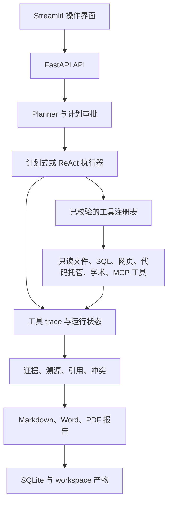

# Traceable Research Agent

[](#快速开始)
[](#快速开始)

**Traceable Research Agent** 是一个可自托管的调研应用，面向需要追溯
结论形成过程的团队。它为任务生成多步计划，只执行已注册的只读工具，将每次
调用和失败持久化为 trace，并生成带证据依据的 Markdown 报告。

[English](README.md) | [快速开始](#快速开始) | [API](#api) | [架构](#架构)

## 核心亮点

- **执行过程可检查**：任务计划、运行状态、进度、工具输入输出、错误、延迟和
  成本估算都会写入 SQLite。
- **默认只读**：本地文件、SQL、网页、代码托管、学术检索和 MCP 工具必须先在
  注册表中显式登记，并在执行前校验。
- **人工掌控**：计划可以暂停并等待审批；受保护的操作也必须经过明确确认，
  不会在后台静默执行。
- **证据优先的报告**：报告旁可查询引用、溯源、来源内容基础、冲突和引用校验
  指标。
- **受治理的调研输入**：检索 profile 会执行信源层级配额、有界候选与抓取预算，
  并将定向补搜写入可审计 trace。
- **本地提取管道**：HTML 多级降级提取、完整性校验缓存、PDF 页级证据和文献
  存在性校验均通过同一套可追溯工具边界运行。
- **无需远程服务也可运行**：确定性规划和本地工具支持离线友好的审计流程；
  网络搜索与 LLM 综合均为可选增强。
- **一条命令部署**：Docker Compose 同时启动 FastAPI 和 Streamlit，运行数据
  保存在挂载的 `workspace/` 目录中。

## 演示

最短演示只使用本地数据：创建三步计划，读取受限目录中的文档，执行只读 SQL
查询，并生成可追溯报告。

```powershell
$body = @{
  task = "审计本地研究说明和文档元数据"
  report_type = "summary"
  source_mode = "mock"
  skill_name = "local_audit"
  require_plan_approval = $true
} | ConvertTo-Json

$created = Invoke-RestMethod -Method Post -Uri http://localhost:8000/api/tasks `
  -ContentType application/json -Body $body

Invoke-RestMethod -Method Get `
  -Uri "http://localhost:8000/api/tasks/$($created.run_id)/review"

$approval = @{ approved = $true; comment = "审批通过" } | ConvertTo-Json
Invoke-RestMethod -Method Post `
  -Uri "http://localhost:8000/api/tasks/$($created.run_id)/approve-plan" `
  -ContentType application/json -Body $approval

Invoke-RestMethod -Method Get `
  -Uri "http://localhost:8000/api/tasks/$($created.run_id)/trace"
```

运行状态会从 `waiting_human_plan` 变为 `completed`。trace 中包含
`memory_recall`、`plan_approval`、本地工具调用和 `citation_validator`。
报告可通过 `GET /api/reports/{run_id}` 获取。

若要运行真实网页调研，请配置 `TAVILY_API_KEY` 后执行：

```powershell
.\.venv\Scripts\python.exe scripts\demo_real_research.py --preset 1 --report-type detailed_report
```

该脚本执行搜索、抓取、证据压缩和报告生成。输出保留在本地的
`docs/examples/`，默认不会作为公开内容发布。

## 快速开始

前置条件：Docker Desktop，或安装了 Compose v2 的 Docker Engine。

```powershell
git clone https://github.com/piao666/traceable-research-agent.git
Set-Location traceable-research-agent
Copy-Item .env.example .env
docker compose up --build -d
```

API 容器启动时会自动执行数据库迁移并初始化本地演示数据库。API healthy 后，
可以访问：

- Streamlit：<http://localhost:8501>
- FastAPI 文档：<http://localhost:8000/docs>
- 健康检查：<http://localhost:8000/health>

查看服务状态和日志：

```powershell
docker compose ps
docker compose logs --tail 100 api
docker compose logs --tail 100 streamlit
```

运行时数据库、报告和证据产物都位于 `workspace/`，该目录会挂载到两个服务中。
以下命令只停止应用，不会删除这些本地数据：

```powershell
docker compose down
```

若使用 Windows 本地虚拟环境，根目录启动脚本会根据自身位置自动解析项目路径，
并启动 FastAPI 与 Streamlit：

```powershell
.\start_traceable_demo.bat --check
.\start_traceable_demo.bat
```

核心应用不依赖 MCP。若需要同时在 9001 端口启动可选 MCP Source Pack，请使用
`start_traceable_demo.bat --with-mcp`。
默认端口不可用时，可在运行脚本前设置 `TRACEABLE_API_PORT`、
`TRACEABLE_STREAMLIT_PORT` 或 `TRACEABLE_MCP_PORT`。

## 配置

复制 `.env.example` 为 `.env`，其中包含全部可配置项。`.env` 只供本地使用，
绝不能提交。

| 设置 | 默认值 | 用途 |
|---|---|---|
| `AUTH_ENABLED` | `false` | 启用本地 API Key 认证。 |
| `DEMO_API_KEY` | 空 | 认证启用时所需的 API Key。 |
| `EXECUTION_MODE` | `planned` | 选择稳定的计划式执行或 `react`。 |
| `OFFLINE_MODE` | `false` | 禁用远程工具，适用于离线环境。 |
| `REPORT_GENERATION_MODE` | `deterministic` | 选择离线安全报告或已配置的 LLM 报告。 |
| `TAVILY_API_KEY` | 空 | 启用真实网页搜索。 |
| `QWEN_API_KEY` / `DEEPSEEK_API_KEY` | 空 | 启用可选的 LLM Provider。 |
| `FILE_READER_ALLOWED_ROOTS` | `workspace/docs` | 本地文件读取的受限根目录。 |
| `CITATION_VALIDATION_LLM_ENABLED` | `false` | 启用可选的 LLM 二次引用校验。 |

远程密钥不是必需项。本地演示和确定性报告路径无需配置任何远程密钥。
当 `AUTH_ENABLED=true` 时，请将密钥放入 `X-API-Key` 请求头，或使用
Bearer 凭据。

## API

| 端点 | 用途 |
|---|---|
| `GET /health` | 查询服务与数据库就绪状态。 |
| `POST /api/tasks` | 创建计划式调研任务。 |
| `GET /api/tasks/{run_id}` | 查询状态、进度、成本和引用指标。 |
| `POST /api/tasks/{run_id}/run` | 执行已创建任务。 |
| `GET /api/tasks/{run_id}/review` | 获取等待审批的计划。 |
| `POST /api/tasks/{run_id}/approve-plan` | 批准、编辑或拒绝计划。 |
| `POST /api/tasks/{run_id}/confirm` | 恢复或拒绝受保护的操作。 |
| `GET /api/tasks/{run_id}/trace` | 查询持久化的工具 trace。 |
| `GET /api/tasks/{run_id}/evidence/v2` | 查询溯源和引用。 |
| `GET /api/reports/{run_id}` | 获取 Markdown 报告。 |
| `GET /api/tools` | 列出已注册工具元数据。 |
| `GET /api/skills` | 列出已安装的任务 Skill。 |

`/docs` 提供完整的 OpenAPI 请求和响应参考。

## 架构



```text
app/api/       FastAPI 端点与响应契约
app/agent/     计划、执行、报告生成和安全护栏
app/tools/     已注册的只读工具实现
app/trace/     run 与工具调用持久化
app/evidence/  溯源、引用和冲突推理
app/memory/    单实例会话与可选记忆
app/skills/    可复用任务定义与校验
app/mcp/       可选的只读 MCP 集成
frontend/      Streamlit 界面
migrations/    Alembic Schema 历史
scripts/       迁移、演示、smoke 与评测命令
workspace/     本地数据库、报告、产物与 Skill
```

## 安全模型

- 执行器只能调用统一注册表中存在的工具。
- `file_reader` 解析路径、阻断目录穿越和逃逸软链接、限制读取长度，并只读取
  已配置根目录下的文件。
- `sql_query` 只接受一条只读 `SELECT` 或 `WITH` 语句，并强制结果行数上限。
- 外部与 MCP 集成均为只读，带超时限制，并从 trace 中脱敏密钥。
- 失败和拒绝的调用也会保留在运行状态与 trace 中。
- 计划审批和高风险工具确认都是显式状态流转，不会隐藏为后台操作。

## 质量验证

当前注册表包含 **12 个只读工具**。最新本地闭环通过 **338 个测试与 17 个
subtests**，并通过 **80/80 条确定性评测**，无 hard failure、无网络跳过。覆盖
信源治理、抓取缓存、PDF 提取、文献校验、学术检索器、API 契约和现有执行路径。

本地运行核心检查：

```powershell
.\.venv\Scripts\python.exe -m compileall -q app scripts frontend migrations tests
.\.venv\Scripts\python.exe -m pytest -q
.\.venv\Scripts\python.exe scripts\smoke_final_project.py
.\.venv\Scripts\python.exe -m app.eval.regression
.\.venv\Scripts\python.exe scripts\skill_smoke.py --all
docker compose config --quiet
```

## 路线图

- [x] 可追溯的计划式执行和可选 ReAct 执行
- [x] 证据溯源、引用校验和人工计划审批
- [x] 信源分层治理、缓存提取、PDF 证据与学术文献校验
- [x] Docker 部署与本地运行数据持久化
- [ ] 在公开再分发前补充仓库许可证
- [ ] 为长时间运行的自托管实例扩展运维可观测性

## 贡献

欢迎提交 Issue 和聚焦的 Pull Request。请遵守项目边界，保持工具只读保证，
为行为变化补充针对性测试，并且不要提交 `.env`、本地数据库、生成报告或其他
本地运行数据。工程规则见 [AGENTS.md](AGENTS.md)。

## 许可证

当前仓库没有根目录 `LICENSE` 文件。在许可证加入前，本 README 不授予使用、
复制、修改或再分发代码的许可。将项目作为公开开源发行版前，请先添加明确的
许可证。

## 参考

这是独立实现。外部 Agent 系统材料只作为只读设计参考，仓库中不复制外部项目
源代码。
