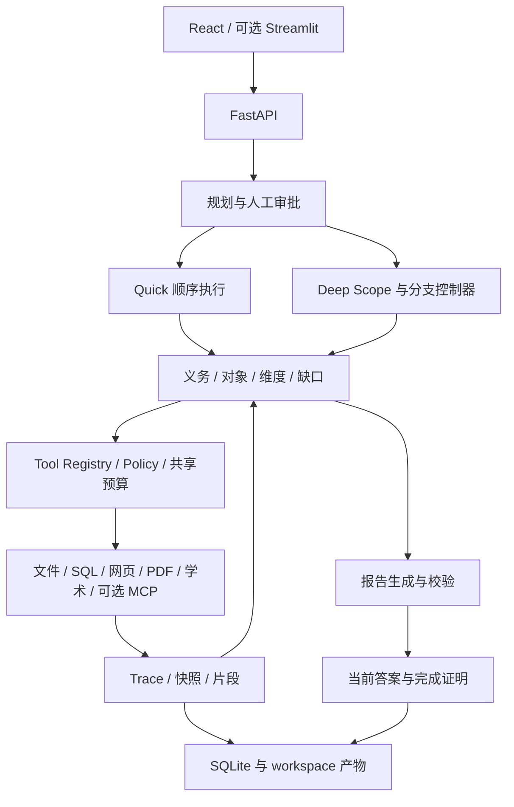

# Traceable Research Agent

[English](README.md) | **简体中文**

一个可自托管的研究工作台，让你从原始问题一路追踪到来源、工具调用和最终报告。

通过 React 界面或 API 规划研究、查看证据、复核缺口和导出报告。
FastAPI 负责执行，SQLite 保存研究历史。

[项目背景](#项目背景) · [项目亮点](#项目亮点) · [快速开始](#快速开始) ·
[部署与启动](#部署与启动) · [如何演示](#如何演示) · [配置](#配置) ·
[API](#api) · [架构](#架构)

## 项目背景

研究报告需要让读者能检查结论依据。仅有引用编号，还无法说明是否读过完整来源、
是否遗漏关键适用条件，以及是否回答了用户提出的全部问题。

Traceable Research Agent 保存报告背后的工作：计划、必答内容、研究分支、
来源快照、证据片段、工具失败和校验裁决。适用于技术调研、来源比较、文献调查，
以及本地文档与数据库复盘。

项目以单实例方式自托管，会话和可选记忆属于当前部署。远程 MCP 工具可按需接入，
核心研究流程无需 MCP 也能运行。

## 项目亮点

| 能力 | 提供什么 |
| --- | --- |
| 快速与深度研究 | Quick 顺序执行计划；Deep 用持久化 Scope 和分支树组织研究，共享根任务预算。 |
| 可检查的执行过程 | 计划、工具输入输出、耗时、失败和已记录用量保存在 Trace 中。 |
| 证据溯源 | 从引用回查片段、来源快照、采集 Trace 和原始 Run。 |
| 必答内容覆盖 | 按对象与维度跟踪研究义务，为缺少的内容生成具体缺口和对应行动。 |
| 报告校验 | 针对当前报告核对引用支持、对象身份、适用条件及必要回答覆盖。 |
| 受治理的工具 | 支持受限文件读取、只读 SQL、网页搜索/抓取、PDF、学术工具及可选 MCP。 |
| 人工控制 | 审阅计划，确认受保护操作，并按指定 Run 批准预算扩容。 |
| 研究工作台 | 查看任务、证据、报告；使用会话、可选记忆、能力清单和运行诊断。 |
| 报告导出 | 在线阅读 Markdown，下载 Markdown、Word 或 PDF，导出 JSON 证据。 |

### 研究如何确认完成

```text
研究义务 → 对象与维度 → 具体缺口 → 对应行动 → 完成确认
```

成功抓取页面会提供候选证据，但不能直接证明问题已经回答完整。
控制器先考虑已保存正文，再进行续读、定向搜索或派发 Deep 分支。
写作证据按对象和维度分别选取；实际证据视图不变时避免重复模型判断。
最终确认把当前答案、引用和覆盖裁决绑定到保存的报告。

工作台区分已获取证据、候选回答和确认回答。缺乏支持时，任务可以保持
`incomplete` 并提供可读的部分报告；模型服务失败也会保留原因。
校验结果用于辅助复核，不保证事实准确率。真实提供方 Quick/Deep 的完整内容验收
和人工复核仍在推进。

## 快速开始

前置条件：Git，以及 Docker Desktop 或带 Docker Compose v2 的 Docker Engine。
以下命令使用 Bash；PowerShell 中请将 `cp` 换为 `Copy-Item`。

### 1. 获取项目并选择配置

```bash
git clone https://github.com/piao666/traceable-research-agent.git
cd traceable-research-agent
cp .env.example .env
```

真实研究需要编辑 `.env`，填写：

```dotenv
LLM_BASE_URL=https://your-provider.example/v1
LLM_MODEL=your-model
REACT_LLM_MODEL=your-model
LLM_API_KEY=your-api-key
TAVILY_API_KEY=your-search-key
```

示例使用 `openai_compatible` 提供方配置，请填写可访问的接口及服务实际支持的模型。
Deep 除报告/规划模型配置外，也使用 Actor 模型设置。

如果想先做**无需远程密钥的本地演示**，请在首次启动前改为将
`.env.example.offline` 复制为 `.env`。该配置使用确定性规划/报告和模拟外部工具，
不会进行真实网页研究。

### 2. 检查网络并启动

当前 Compose 文件默认通过主机代理 `http://host.docker.internal:7897`
发送外部请求。开始真实研究前，请配置可用代理，或使用
[直连网络覆盖配置](#网络与代理配置)。

```bash
docker compose up --build -d api web
docker compose ps
```

等待 API 显示 healthy 后访问：

| 入口 | 默认地址 |
| --- | --- |
| React 研究工作台 | http://localhost:5173 |
| API 文档 | http://localhost:8000/docs |
| 健康检查 | http://localhost:8000/health |

### 3. 发起第一个任务

打开“新建研究”，输入问题、选择 Quick 或 Deep，检查计划后批准执行。
运行中查看工作台、证据和报告页；首次无密钥体验可使用下方的
[演示流程](#如何演示)。

## 部署与启动

### 服务与持久化数据

Compose 包含三个服务：

| 服务 | 职责 | 默认主机端口 |
| --- | --- | --- |
| `api` | FastAPI、工具、研究控制器及数据库访问 | 8000 |
| `web` | Nginx 提供 React 构建产物并转发 API 请求 | 5173 |
| `streamlit` | 可选的另一套操作界面 | 8501 |

执行 `docker compose up --build -d` 可启动全部服务。API 镜像安装 API 依赖，
可选 Streamlit 镜像额外安装其依赖。API 启动入口自动应用数据库迁移，
仅在演示数据库不存在时初始化；`DOCKER_INIT_DEMO_DATA=false` 可关闭演示初始化。

| 存储内容 | 默认 Compose 部署位置 |
| --- | --- |
| Run、Trace、研究状态的 SQLite 数据库 | `traceable_db` 命名卷，挂载至 `/app/data` |
| 证据产物、报告、本地输入和演示数据库 | 主机 `workspace/`，挂载至 `/app/workspace` |
| 密钥与本地配置 | 主机 `.env` |

升级前应备份数据库卷和 `workspace/`，建议停止服务后备份。
`docker compose down` 停止服务并保留这些数据；`down -v` 会删除命名卷。

```bash
docker compose logs --tail 100 api
docker compose logs --tail 100 web
docker compose down
```

拉取新代码后，执行 `docker compose up --build -d api web` 重建并启动。
仅修改 `.env` 时，执行 `docker compose up -d --force-recreate api` 应用配置。
简单 restart 不会重建镜像，也不会重新加载变更后的 Compose 环境变量。

### 网络与代理配置

在 `.env` 中通过 `DOCKER_HTTP_PROXY`、`DOCKER_HTTPS_PROXY` 和
`DOCKER_SSRF_TRUSTED_PROXY_URL` 指定可访问的主机代理，
`DOCKER_NO_PROXY` 控制排除项。Compose 使用 `${VARIABLE:-default}`，
因此空值不会关闭默认代理。

无需代理时，可创建本地 `compose.direct.yml`：

```yaml
services:
  api:
    environment:
      HTTP_PROXY: ""
      HTTPS_PROXY: ""
      SSRF_TRUSTED_LOCAL_PROXY_URL: ""
```

使用覆盖文件启动，后续 Compose 命令也需带上该文件：

```bash
docker compose -f docker-compose.yml -f compose.direct.yml up --build -d api web
```

镜像构建使用 Docker 自身的下载/代理设置。构建失败时检查输出及 Docker 网络，
再重试失败的构建；API 运行时代理配置不会自动配置镜像下载。

### 从源码启动

本地开发需要 Python 3.11+ 和 Node.js 20+。在仓库根目录按上方说明选择并编辑
`.env`，然后建立虚拟环境：

```bash
python -m venv .venv
source .venv/bin/activate
python -m pip install -r requirements.txt
python scripts/migrate_database.py
python scripts/init_demo_db.py
python -m uvicorn app.main:app --host 127.0.0.1 --port 8000
```

Windows PowerShell 使用 `.\.venv\Scripts\Activate.ps1` 激活环境。
另开终端启动 React：

```bash
cd web
npm ci
npm run dev
```

Vite 将 `/api` 和 `/health` 转发到 8000 端口。使用另一套界面时，在已激活环境的
仓库根目录执行 `streamlit run frontend/streamlit_app.py`。
Windows 还可运行 `start_traceable_demo.bat --check` 检查，或
`start_traceable_demo.bat` 启动 API/Streamlit；`--with-mcp` 会增加可选的
本地 MCP Source Pack。这些脚本不启动 React。

## 如何演示

### 本地文档与 SQL：无需远程密钥

在全新部署中使用离线配置，并保持演示初始化开启。
仓库附带 `workspace/docs/demo_research_note.md` 和初始化后的 `demo.sqlite`
作为小型输入。以下 PowerShell 流程为已注册的文件/SQL 工具建立计划：

```powershell
$api = "http://localhost:8000"
$body = @{
  task = "Read local docs demo_research_note.md and query database: SELECT id, title, category FROM documents"
  report_type = "summary"
  research_mode = "quick"
  source_mode = "mock"
  skill_name = "none"
  allowed_tools = @("file_reader", "sql_query", "report_writer")
  require_plan_approval = $true
} | ConvertTo-Json

$created = Invoke-RestMethod -Method Post -Uri "$api/api/tasks" `
  -ContentType "application/json" -Body $body
$runId = $created.run_id
Invoke-RestMethod "$api/api/tasks/$runId/review"
```

检查返回的计划，然后批准并查看结果：

```powershell
$approval = @{ approved = $true; comment = "Reviewed local demo plan" } | ConvertTo-Json
Invoke-RestMethod -Method Post -Uri "$api/api/tasks/$runId/approve-plan" `
  -ContentType "application/json" -Body $approval
Invoke-RestMethod "$api/api/tasks/$runId"
Invoke-RestMethod "$api/api/tasks/$runId/trace"
Invoke-RestMethod "$api/api/reports/$runId"
```

在 React 的 `/runs/{run_id}` 可以查看同一任务，沿文件/SQL 调用查看证据与报告。
该确定性演示用于展示执行和持久化；严格回答校验可能使其保持 `incomplete`
并提供部分报告，应与完整通过校验的联网研究结果区分。

### 真实网页研究

配置模型和搜索密钥后，在“新建研究”中尝试：

> 解释数据库预写日志的适用条件与取舍，分别回答并发、检查点、网络文件系统和故障恢复，
> 引用一手来源。

Quick 用于范围明确的初步研究，Deep 用于需要分解问题和多来源核验的研究。
选择 real 来源，检查并批准计划。在工作面板逐项查看必要维度，沿引用回查原文。
继续执行前审阅部分结果或预算申请。这些操作会使用已配置的提供方并消耗其额度。

## 配置

`.env.example` 提供主要真实研究配置，`.env.example.full` 列出高级项，
`.env.example.offline` 提供演示档位。显式环境变量覆盖档位默认值。
`.env` 与提供方密钥只保留本地。

| 设置 | 用途 / 示例 |
| --- | --- |
| `RESEARCH_PROFILE` | `deep`、`standard` 或 `offline`，决定运行默认配置，与任务的 Quick/Deep 选择不同 |
| `LLM_PROVIDER`、`LLM_BASE_URL`、`LLM_MODEL`、`LLM_API_KEY` | 规划/报告模型连接，真实示例使用 `openai_compatible` |
| `REACT_LLM_PROVIDER`、`REACT_LLM_MODEL` | Deep Actor 模型配置 |
| `TAVILY_API_KEY` | 真实网页搜索密钥 |
| `DEEP_RESEARCH_ENABLED`、`REACT_ENABLED` | Deep 执行要求两者同时开启 |
| `RESEARCH_MAX_TOOL_CALLS` | 根/分支共享工具上限，Deep 档位默认 80 |
| `RESEARCH_MAX_LLM_CALLS` | 共享逻辑模型调用上限，Deep 默认 192 |
| `RESEARCH_MAX_TOKENS` | 共享 Token 上限，Deep 默认 400000 |
| `RESEARCH_MAX_SECONDS` | 共享执行时间额度，Deep 默认 1800 秒 |
| `FETCH_BROWSER_ENABLED` | 动态页面浏览器后备，示例默认 `false`，需要可启动的 Chromium |
| `FETCH_REMOTE_EXTRACT_ENABLED` | 已配置的远程正文后备，示例默认 `false` |
| `FILE_READER_ALLOWED_ROOTS` | 允许读取的本地根目录，默认 `workspace/docs` |
| `DOCKER_INIT_DEMO_DATA` | 初始化缺失的演示数据库，默认 `true` |
| `AUTH_ENABLED`、`DEMO_API_KEY` | 可选 API Key 认证，默认关闭 |

新义务任务触达 Token 或模型调用硬上限时可进入 `waiting_human`。
为指定 Run 批准更高 `max_tokens`、`unlimited_tokens: true`，或更高的有限
`max_llm_calls` 后继续。Token 批准不扩充工具、调用次数、时间或成本限制。
既有用量与证据保留，报告生成的预留额度来自同一总预算。

启用 API 认证后，请发送 `X-API-Key` 或 Bearer 凭据。
当前 React UI 不收集凭据，按本地默认配置运行；启用认证的部署需另外提供带认证的访问方式。

## API

API 服务的 `/docs` 和 `/openapi.json` 提供完整请求/响应定义。

| 方法与路径 | 用途 |
| --- | --- |
| `GET /health` | 服务健康状态 |
| `GET /api/runtime/capabilities` | 已配置能力，不代表提供方连接已验证 |
| `GET /api/runtime/diagnostics` | 本地运行/数据库诊断 |
| `POST /api/runtime/preflight` | 显式真实提供方探测，会消耗提供方额度 |
| `POST /api/tasks` | 创建任务和持久化计划 |
| `GET /api/tasks` | 任务列表及筛选 |
| `GET /api/tasks/{run_id}` | 状态、进度与已记录用量 |
| `GET /api/tasks/{run_id}/plan` | 计划、预算及研究工作状态 |
| `GET /api/tasks/{run_id}/review` | 待审批计划 |
| `POST /api/tasks/{run_id}/approve-plan` | 批准/编辑/拒绝计划，批准后开始执行 |
| `POST /api/tasks/{run_id}/run_async` | 后台启动待执行任务 |
| `POST /api/tasks/{run_id}/confirm` | 确认/拒绝受保护操作或预算变更 |
| `POST /api/tasks/{run_id}/cancel` | 取消任务 |
| `POST /api/tasks/{run_id}/retry` | 创建新的重试 Run |
| `GET /api/tasks/{run_id}/trace` | 持久化工具调用 |
| `GET /api/tasks/{run_id}/events` | SSE 进度事件 |
| `GET /api/tasks/{run_id}/result/evidence` | 用户可见 Run/Scope 范围内的证据 |
| `GET /api/tasks/{run_id}/result/trace` | 结果各研究分支的 Trace |
| `GET /api/tasks/{run_id}/research-tree` | Deep 研究树 |
| `GET /api/tasks/{run_id}/evidence/export/download?format=json` | 下载证据 |
| `GET /api/reports/{run_id}` | 报告正文及可用状态 |
| `GET /api/reports/{run_id}/download?format=markdown` | 下载报告，也接受 `docx` 和 `pdf` |
| `GET /api/tools`、`GET /api/skills` | 注册工具与任务定义 |

创建任务本身不执行任务。`require_plan_approval=true` 时需检查并批准计划，
其他情况通过执行接口启动。会话、记忆与质量统计接口也在 OpenAPI 中提供。

## 架构


```mermaid
flowchart TD
    UI[React / 可选 Streamlit] --> API[FastAPI]
    API --> Plan[规划与人工审批]
    Plan --> Quick[Quick 顺序执行]
    Plan --> Deep[Deep Scope 与分支控制器]
    Quick --> Work[义务 / 对象 / 维度 / 缺口]
    Deep --> Work
    Work --> Tools[Tool Registry / Policy / 共享预算]
    Tools --> Inputs[文件 / SQL / 网页 / PDF / 学术 / 可选 MCP]
    Inputs --> Evidence[Trace / 快照 / 片段]
    Evidence --> Work
    Work --> Report[报告生成与校验]
    Report --> Proof[当前答案与完成证明]
    Evidence --> Store[SQLite 与 workspace 产物]
    Proof --> Store
```

```text
引用 → 片段 → 来源快照 → Trace → 原始 Run
```

正文产物、有界写作窗口和引用出现位置保留身份与哈希。
Deep 汇总分支证据时保留原始 Run/Trace。报告修订重新检查覆盖，
删除必要回答不会删除其研究义务。

```text
app/api/        HTTP 接口与契约
app/agent/      规划、调度、共享预算与报告
app/research/   Scope/树、工作控制器、缺口与覆盖
app/retrieval/  HTTP/浏览器/远程/PDF 采集路由
app/tools/      注册工具实现
app/evidence/   来源产物、溯源与引用校验
app/reporting/  证据投影、结论出现位置与修订流程
app/trace/      Run 与工具调用持久化
app/memory/     会话与可选本地记忆
app/skills/     可复用任务定义
app/mcp/        可选 MCP 集成
web/            React / TypeScript / Vite 前端
frontend/       Streamlit 备选前端
migrations/     Alembic 数据库迁移
scripts/        启动、演示与验证
workspace/      本地输入、证据产物与报告
```

工具通过注册表和权限边界执行。文件读取限制在配置根目录内，SQL 只读并有行数上限，
网络操作有超时控制，Trace 脱敏；高风险操作需要确认。
项目不提供租户隔离、向量索引或 RAG 服务。

## 开发与验证

安装开发依赖后运行：

```bash
python -m compileall -q app scripts frontend migrations tests
python scripts/run_offline_tests.py --runner pytest
python scripts/smoke_research_integrity.py
docker compose config --quiet
cd web
npm run typecheck
npm run lint
npm test
npm run build
```

离线测试入口和 API smoke 使用一次性本地数据，不能证明真实提供方的回答质量。
验收边界见[发布验证清单](RELEASE_VALIDATION.md)，贡献约束见
[工程规则](AGENTS.md)。不要提交密钥、运行数据库或生成的报告。

## 许可证

仓库目前没有根目录 `LICENSE` 文件，许可条款仍待明确；本 README 不作为许可证。
